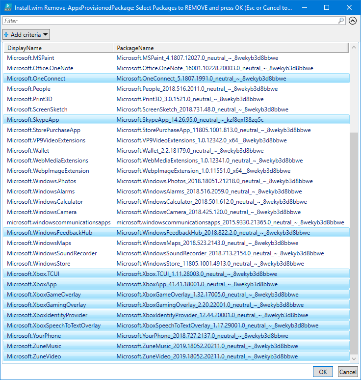
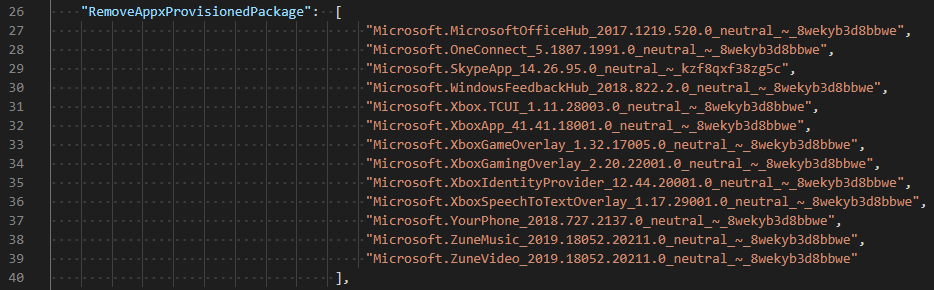

# Remove Appx Provisioned Package

When creating an OSBuild for Windows 10, your have the option to remove Provisioned Appx Packages

## -RemoveAppxProvisionedPackage

Using this parameter with [**`New-OSBuildTask`**](../../../../../osbuilder/docs/functions/osbuild/new-osbuildtask/), you will be prompted to select Appx Packages to remove from your OSBuild.

```text
New-OSBuildTask -TaskName Demo -RemoveAppxProvisionedPackage
```

Simply multi-select the Appx Packages you want to Remove and press OK



The selected Appx Packages will be added to the OSBuild Task.  When executing [**`New-OSBuild`**](../../../../../osbuilder/docs/functions/osbuild/new-osbuild.md), the Appx Packages will be removed




