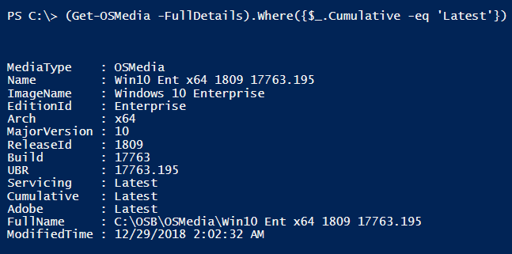
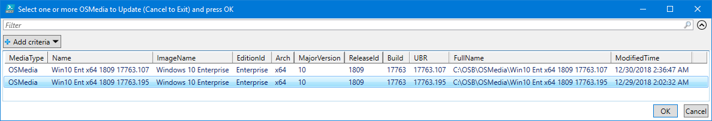

# Get-OSMedia

## Parameters

* `[switch] FullDetails`
  * Displays Update Information \(Servicing, Cumulative, Adobe\)
* `[switch] GridView`
  * Displays results in GridView

## Usage

`Get-OSMedia` will return all [`OSMedia`](./) as a PowerShell Custom Object


## Get-OSMedia -FullDetails

This will determine if the Updates are the Latest available. Cumulative Update information is obtained by parsing an exported Sessions.xml file \(exported in OSDBuilder 18.12.5 or newer\)


## Get-OSMedia -FullDetails -Verbose

Even more detail can be viewed when using the -Verbose parameter. This will display information about the Updates that are validated. This process can take up to a minute for multiple OSMedia


## Get-OSMedia -GridView

You can display the results in GridView using this parameter. This will allow you to select multiple OSMedia using PassThru


## Piping: GridView

As an alternative, you can use the following commands to perform a GridView

```text
Get-OSMedia | Out-GridView
Get-OSMedia -FullDetails | Out-GridView -PassThru
```


## Piping: Show-OSInfo

You can also pipe OSMedia to some other OSDBuilder functions like[`Show-MediaInfo`](../show-osbmediainfo.md) using any of the following commands

```text
Get-OSMedia -FullDetails | Out-GridView -PassThru | Show-MediaInfo
Get-OSMedia -FullDetails | Where-Object {$_.Cumulative -eq 'Latest'} | Show-MediaInfo
(Get-OSMedia -FullDetails).Where({$_.Cumulative -eq 'Latest'}) | Show-MediaInfo
```


## Piping: Update-OSMedia

You can even use `Get-OSMedia` to download updates for all your existing [`OSMedia`](./)**\`\`**

```text
Get-OSMedia | Update-OSMedia -DownloadUpdates
```


## Where Method: Display only Latest CU

You can use the Where Method to display the OSMedia with the Latest Cumulative Update

`(Get-OSMedia -FullDetails).Where({$_.Cumulative -eq 'Latest'})`



## Internal Functions

`Get-OSMedia` will be used internally in other OSDBuilder functions. For example, [`Update-OSMedia`](update-osmedia.md) used to use a simple selection based on Directories contained in OSMedia


`Get-OSMedia` will allow more detailed information in the selection of OSMedia to Update



