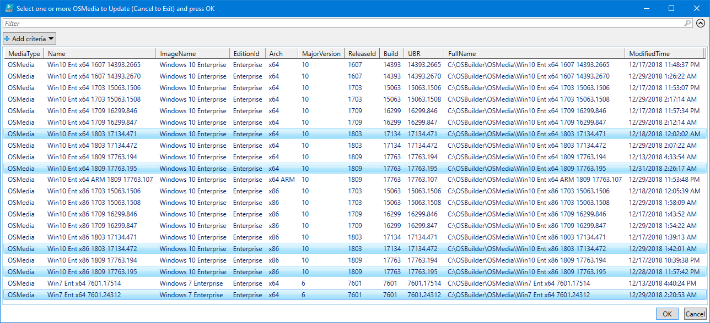
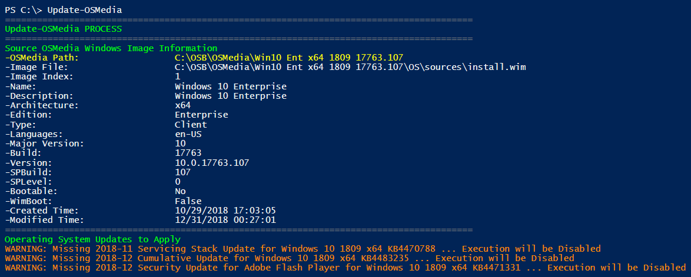
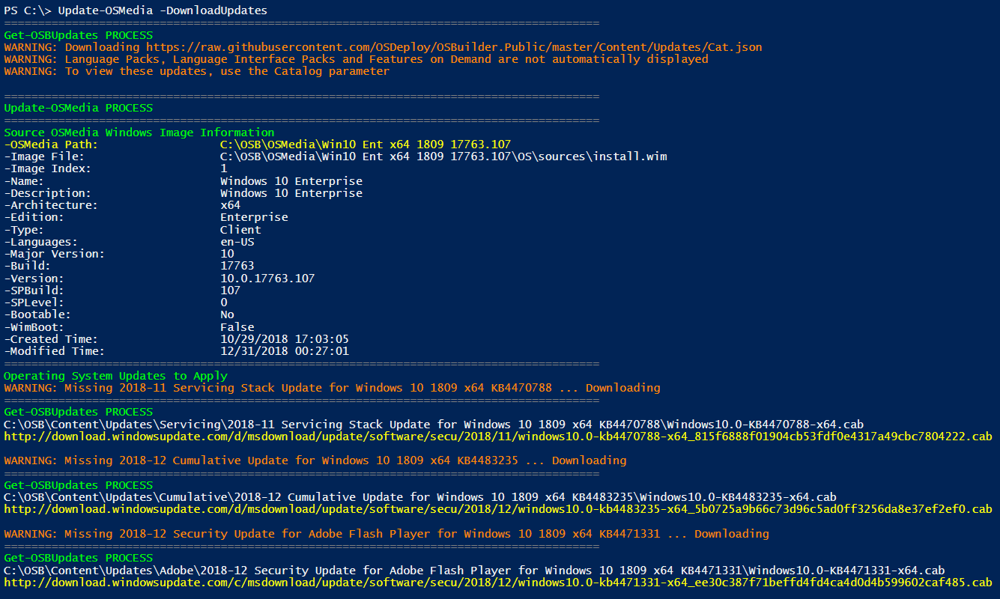
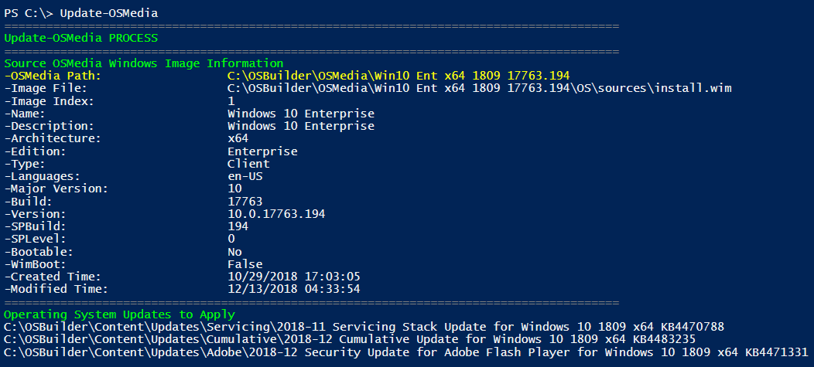

# Update-OSMedia

**`Update-OSMedia`** is used to apply Microsoft Updates to an imported OSMedia.  This includes the following updates:

* Setup
* Component
* SSU - Servicing Stacks
* LCU - Cumulative Updates
* ASU - Adobe Security Updates

Simply execute Update-OSMedia without any Parameters.  You will be prompted to select an imported **`OSMedia`** \(PowerShell ISE is required to select the Operating System\).  Make a selection and press OK.

When running **`Update-OSMedia`** without any parameters, information about the Operating System will be displayed including the required updates.

In the image below, the Microsoft Updates were not previously downloaded into OSDBuilder and a Warning message is displayed that Execution will be Disabled

## Update-OSMedia -DownloadUpdates

To download Microsoft Updates simply add the **`DownloadUpdates`** parameter.  This will automatically update the OSDBuilder Catalogs and the required Microsoft Updates for the selected OSMedia


You can select multiple OSMedia at the same time to download all your required Microsoft Updates


After the download of the Microsoft Updates is complete, you should be ready to go.  Running **`Update-OSMedia`** again should show the Microsoft Updates without the Warning, and you should be ready to Update the OSMedia

