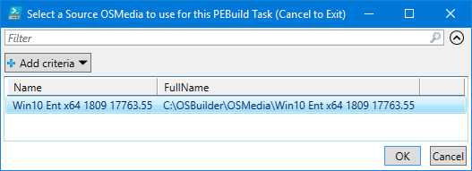
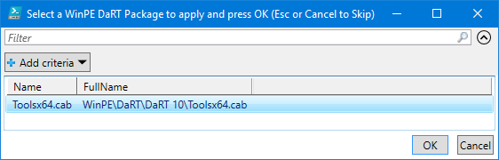
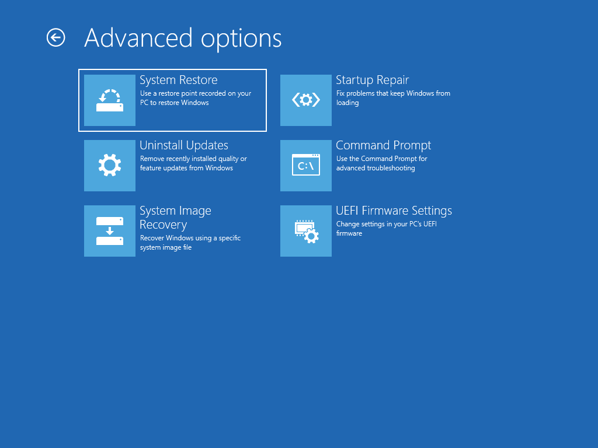

# Recovery

Start by selecting `New-PEBuildTask` and select the `Recovery` tab.  Keep the Task Name simple, and remember Recovery will be automatically added as a Task Name prefix.

This task will use WinRE.wim to create Recovery Media.

You also have the option to include [**`-AutoExtraFiles`**](../../../../recycle-bin/instructions/detailed/pebuild/auto-extrafiles.md) and set the **`-ScratchSpace`**.  The default Scratch Space for WinPE is 32MB, but if you do not select an option \(since this is not a Mandatory parameter\), this will automatically be set to 128MB.

## Select OSMedia

You will be prompted to select an OSMedia to use for the Task.  By design, if you entered a Windows Version in the Task Name \(1803, 1809\) you will only be shown OSMedia that matches that Windows Version.

## WinPE Additional Content

If you have added WinPE Content to OSDBuilder \(DaRT, Drivers, Extra Files, ADK Package\), you will be able to select them to complete the Task.

## Complete Task

Once the Task is complete, you can use `New-PEBuild` to build the Recovery Media

## Demo

