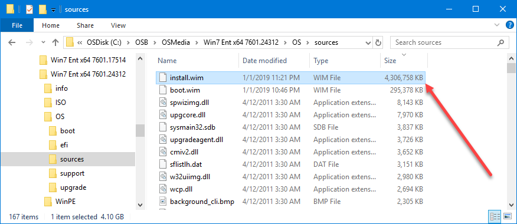

# Build and Capture

Windows 7 SP1 is now ready to be added to a Build and Capture Task Sequence, with some things to understand.  For starters, you can see that the WIM is rather large.  Windows 7 does not support performing a DISM Image Cleanup offline, so you need to complete this in a Build and Capture Task Sequence

## Resources

For more information on how to do this, I strongly recommend you follow [**Ioan Popovici**](https://twitter.com/IoanPopovici) of [**SCCM Zone**](https://sccm-zone.com/) ****and check out these links





