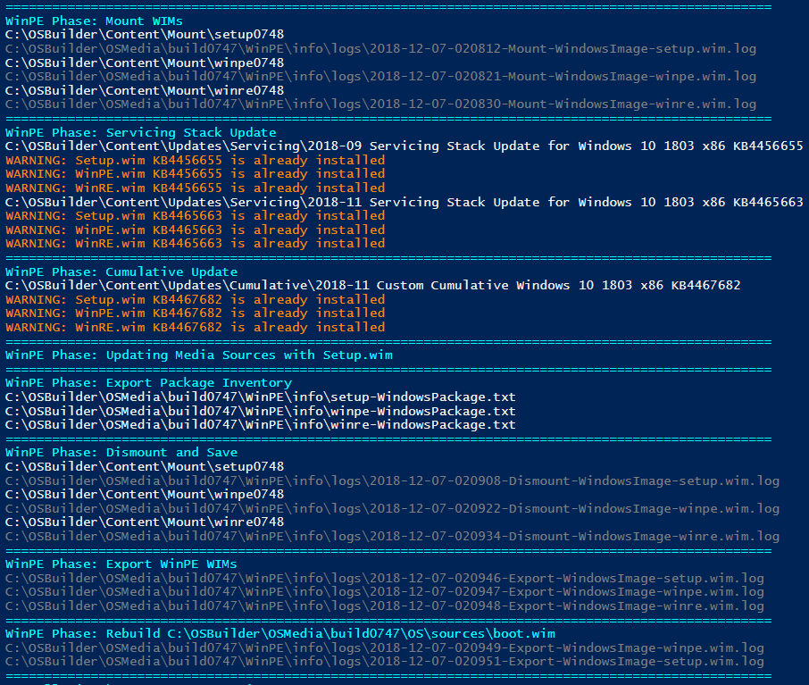
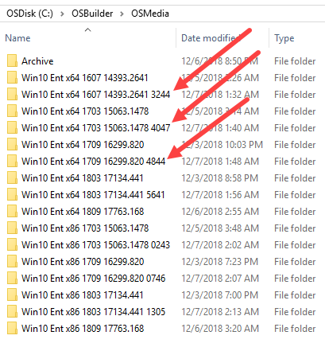

# Support

**OSDBuilder** is free to use without any guarantee of support.  If you run into issues, I ask that you keep this in mind:

I work for a large Enterprise, and have worked there for over 15 years.  **I am not a Consultant**

The primary reason that OSDBuilder was developed, was to bring automation into my Office Servicing process.  I have tried to keep things as open as possible, and have spent hours in the development of OSDBuilder.  In addition, I have spent additional hours in Documentation online, and sharing my knowledge through Twitter and speaking at User Groups.  **Everyone using OSDBuilder should have a good knowledge of Windows Imaging and a working knowledge of PowerShell.**  If you do run into issues, feel free to reach out to me but you will need to do a fair amount of troubleshooting as a way to "give back".

**Keep in mind . . . OSDBuilder is free**

## Best Practices

While nothing in here is a requirement, these are the best pieces of advice I can give

* **Dedicated Stand Alone Workstation Class Computer**
* **Administrative Rights**
* **AntiVirus On-Access Scan Disabled, or at least exclude the OSBuilder directory and PowerShell DISM processes**
* **Don't assume everything worked properly, review the PowerShell Console for error messages**
* **Review the LOGS**

## Troubleshooting

I have made it very easy to know which LOG file you need to review.  If you come across an error, review the LOG that is associated with the step you were running.  You will probably find some good information in there.

## UBR Doesn't Change

You will see the following displayed in the PowerShell Console

Your Media directories will have something added in the Directory Name after the UBR

The only reason that this happens is because the Cumulative Update did not install.  This can be for any of the following reasons:

* It was not needed
* A prerequisite was not met \(Servicing Stack\)

