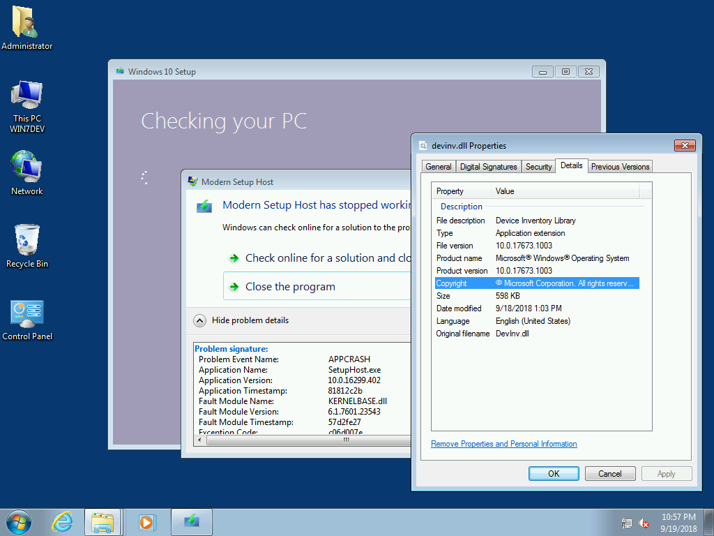

# 2018-09

## 18.9.21.0 \(September 21, 2018\)

* UBR now gathered from the mounted Image Registry
* Registry Export of OS Properties saved as CurrentVersion.txt

## 18.9.20.1 \(September 20, 2018\)

* Update Catalog contains 4 Setup Updates \(1709 and 1803\)
* UBR is now calcuated with DISM

## 18.9.20.0 \(September 20, 2018\)


Updating Sources with Robocopy and extracting Setup Component to Sources are causing issues with Upgrade Task Sequences

After applying this OSBuilder Update, you should Update-OSMedia from the original Import-OSMedia.  OSBuilds will have to be recreated after OSMedia has been updated


* **Import-OSMedia**
  * Modified method for calculating UBR, now gathered through Rollup Package information
* **Update-OSMedia**
  * Modified method for calculating UBR, now gathered through Rollup Package information
  * Removed Robocopy of Sources directory
* **Invoke-OSBuildTask**
  * Modified method for calculating UBR, now gathered through Rollup Package information
  * Removed Robocopy of Sources directory

## 18.9.14.\* \(September 14, 2018\)

* **Import-OSMedia**
  * UpdateOSMedia parameter added to automatically download Microsoft Updates and to execute Update-OSMedia
* **Update-OSMedia**
  * ByName parameter added to prevent GridView selection
  * DownloadUpdates parameter added to automatically download Microsoft Updates that are needed for execution
* **Invoke-OSBuildTask**
  * DownloadUpdates parameter added to automatically download Microsoft Updates that are needed for execution

## 18.9.13.\* \(September 13, 2018\)

* Resolved an issue where the UBR is not updated properly in ntdll.dll / ntoskrnl.exe
* Added detection method \(Sessions.xml\) to determine if a Cumulative Update was installed.  This allows for the skipping of a reinstall

## 18.9.12.\* \(September 12, 2018\)

* **Content**
  * Removed Test-Build directory
  * Removed Content\UpdateStacks directory
  * Removed Content\UpdateWindows directory
  * Content\Updates directory contains all updates \(Adobe, Component, Cumulative, Setup, Servicing\)
  * Content\Provisioning directory has been added, but not used at this time \(future\)
* **Functions**
  * Get-OSBuilder - removed DownloadUpdates parameter
  * Get-OSBuilderUpdates - new function to download all Updates
  * Invoke-OSBuildTask
    * Rename of Invoke-OSBuilderTask
    * OSMedia tasks have been removed
    * ExecutionMode has been removed and replaced with an Execute parameter
    * TestMode has been removed
    * Stepped has been removed
    * Information of the Task is displayed when the Execute parameter is not present
  * New-OSBuildTask
    * Rename of New-OSBuilderTask
    * Used for creating an OSBuild, from OSMedia
  * Update-OSMedia
    * Used to update OSMedia

