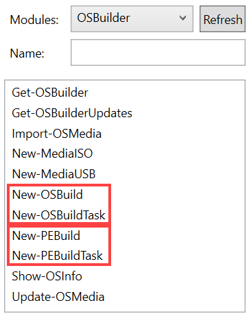
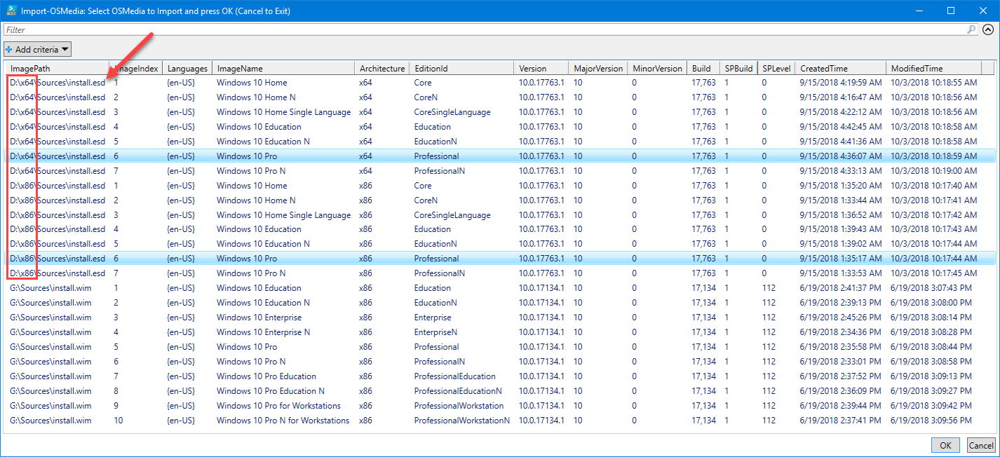
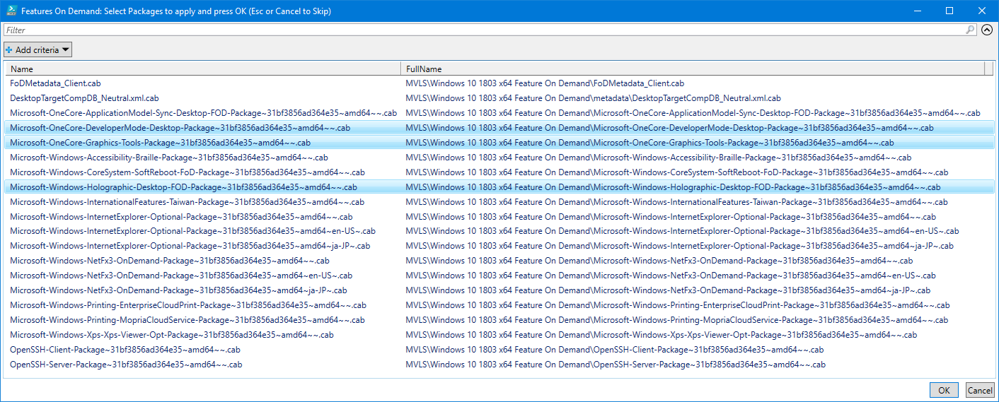

# 2018-10

## 18.10.26.0 \(October 26, 2018\)

* **Import-OSMedia**
  * Add EditionId parameter
  * Add ImageIndex parameter
  * Add ImageName parameter
  * Add SkipGridView parameter
* **New-OSBuildTask**
  * Updated Warning messages
* **Get-OSBuilder**
  * Updated Warning messages



## 18.10.22.x \(October 22, 2018\)

* **Get-OSBuilderUpdates**
  * Optional Updates are hidden by default
* **Invoke-OSBuild**
  * Renamed to New-OSBuild
* **Invoke-PEBuild**
  * Renamed to New-PEBuild
* **New-OSBuilderISO**
  * Renamed to New-MediaISO
* **New-MediaISO**
  * OSCDIMG can now be executed from OSBuilder\Content\Tools\&lt;arch&gt;\Oscdimg
    * Copy amd64 and x86 directories from C:\Program Files \(x86\)\Windows Kits\10\Assessment and Deployment Kit\Deployment Tools
  * GridView will now display and sort by LastWriteTime
* **New-OSBuilderUSB**
  * Renamed to New-MediaUSB
* **New-MediaUSB**
  * GridView will now display and sort by LastWriteTime
  * GridView will now display Parent and CreationTime

The changes related to the renaming of functions allow related functions to be grouped together to make things easier to identify.  Documentation reflecting the changes will follow shortly.

## 18.10.18.0 \(October 18, 2018\) @ [HASMUG](http://www.hasmug.com/)

* **Get-OSBuilder**
  * Added PEBuilds
* **Import-OSMedia**
  * Collect WinPE Auto ExtraFiles
* **Invoke-OSBuildTask**
  * Renamed to Invoke-OSBuild
* **Invoke-OSBuild**
  * Collect WinPE Auto ExtraFiles
  * Add Advanced ParameterSet
  * Add Parameter PromptBeforeDismount
  * Add Parameter PromptBeforeDismountWinPE
* **New-OSBuilderISO**
  * Corrected OSImageName
  * Add PEBuild support
* **New-OSBuilderUSB**
  * Add PEBuild support
* **New-OSBuildTask**
  * Modified FOD Placement
* **New-PEBuildTask**
  * New function to create a WinPE Task
* **Invoke-PEBuild**
  * New function to execute a PEBuild Task
* **Update-OSMedia**
  * Collect WinPE Auto ExtraFiles
  * Add Parameter PromptBeforeDismount
  * Add Parameter PromptBeforeDismountWinPE

This release introduces PEBuilds.  Documentation is being added to the following section



## 18.10.10.0 \(October 10, 2018\)

* **Get-OSBuilder**
  * Content\StartLayout is no longer Recursed
  * Content\Unattend is no longer Recursed
* **Get-OSBuilderUpdates**
  * HideOptionalUpdates Parameter added
* **Invoke-OSBuildTask**
  * Selecting an Unattend.xml will Use-WindowsUnattend for OfflineServicing and copy the Unattend.xml to Windows\Panther
  * Variables.xml and Variables.json exported \(for creating custom Scripts\)
* **Update-OSMedia**
  * Variables.xml and Variables.json exported \(for creating custom Scripts\)

## 18.10.4.\* \(October 4, 2018\)

* Added logic for Windows Server 2019
* Operating System Media using Install.ESD \(including dual Architecture\) can now be imported

## 18.10.3.\* \(October 3, 2018\)

Lots of changes, and yes your Tasks will have to be rebuilt

* **Setup.exe and SetupHost.exe are now in sync**
  * This lets you image from an ISO without errors now
* **Get-OSBuilder**
  * Changed Parameter OSBuilderPath to SetPath
* **Get-OSBuilderUpdates**
  * Added FeatureOnDemand Catalog
  * Added LanguagePack Catalog
  * Added LanguageInterfacePacks Catalog
  * Added LanguageFeature Catalog
* **Invoke-OSBuildTask**
  * Added option to select a custom SSU and CU
* **New-OSBuildTask**
  * Modifying Build In Appx, Components, and Features require a Parameter
  * Added Language Options for the Install.wim \(not working in WinPE yet\)
* **Update-OSMedia**
  * Added option to select a custom SSU and CU
* **MVLS Language Pack ISO Support**
  * Expand your MVLS Language Pack ISO in the Content\MVLS directory to add Language Pack Selection to a Task
* **MVLS Features On Demand ISO Support**
  * Expand your MVLS Features On Demand ISO in the Content\MVLS directory to add Features to a Task

## 

