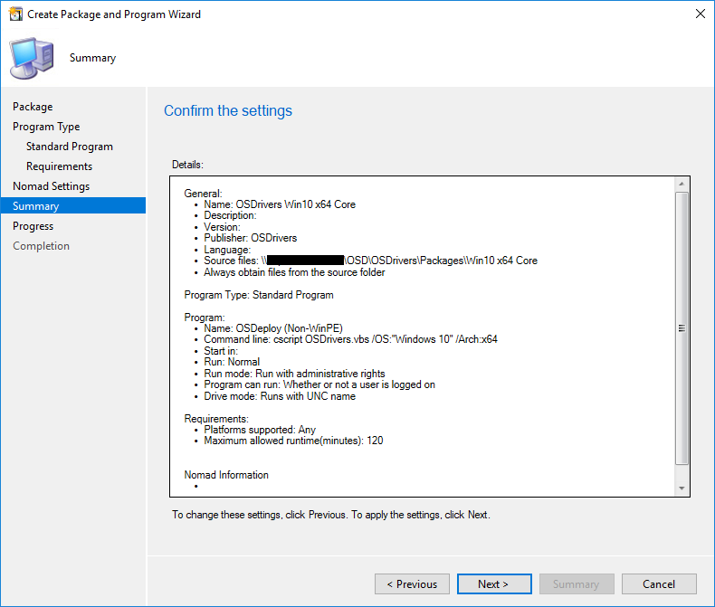

# Create Packages

Move your Package Content into your ConfigMgr Packages Share like the configuration below


## Program Type

Create a Standard Program


## Standard Program

Standard Programs do no run in WinPE, so specify in the Name that this is \(Non-WinPE\)

For the Command Line, you need to ensure that the OS and Architecture are specified. Since it is possible to run this in an Upgrade Task Sequence, if you are upgrading from Windows 7, it would not install Windows 10 Drivers without this specification. Make sure it is set to run "Whether or not a user is logged on"

```text
cscript OSDrivers.vbs /OS:"Windows 10" /Arch:x64
```


## Summary

Confirm the Settings



## Completion

Looking good!


## Additional Packages

Repeat the same steps for your remaining Packages.


