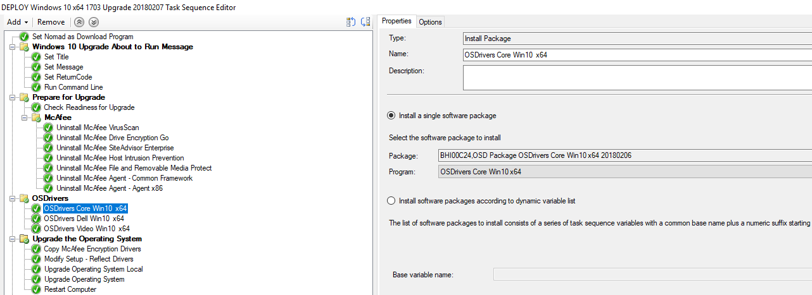
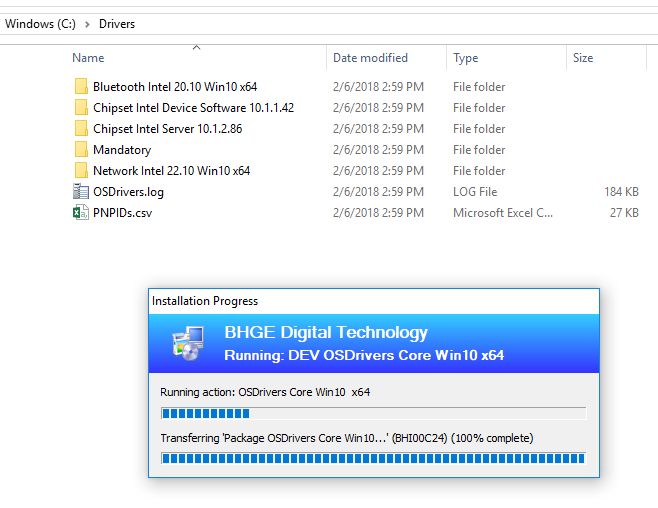

# Refresh or Upgrade Task Sequence

Add new Install Package steps to your Task Sequence and set the proper Program. Repeat this for every OSDrivers Package you want to apply.

## Execution

During an OSD Task Sequence, when the Package executes, it will place the Drivers in C:\Drivers where the Install Operating System will apply the Drivers to Windows 10.

