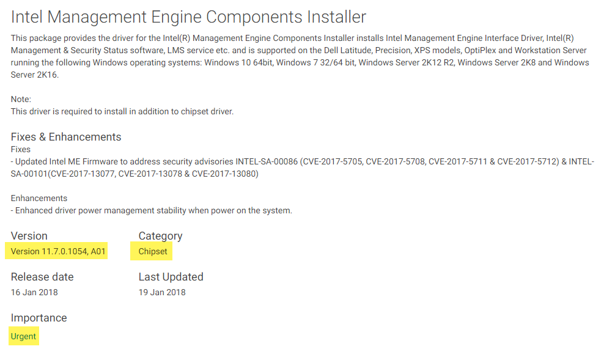
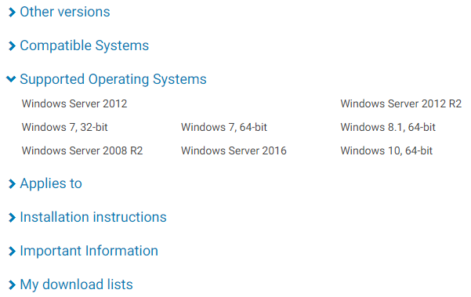
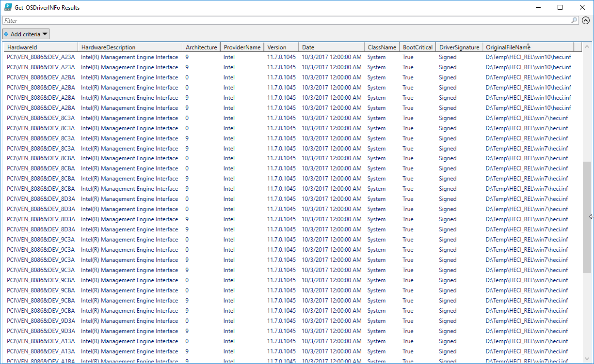
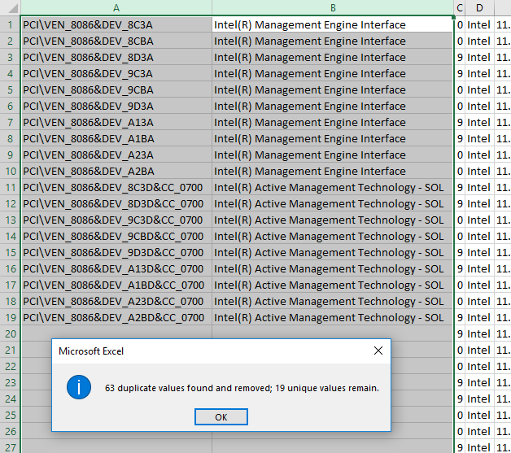
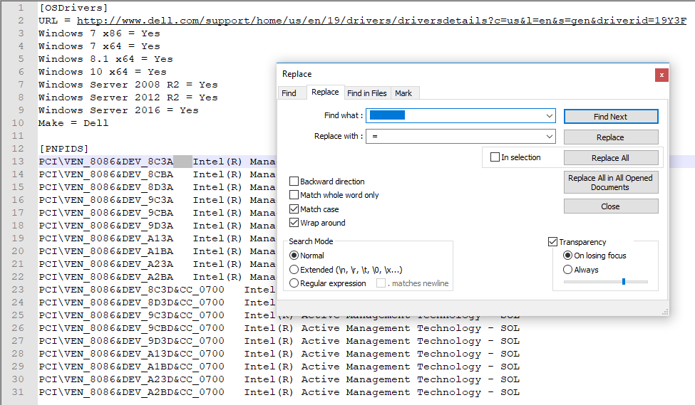

# Create a Custom Driver CAB

So I see that Dell posted an update to Intel Management Engine Components Installer which is Urgent. I have highlighted the important fields and will go ahead and download the driver.

[http://www.dell.com/support/home/us/en/19/drivers/driversdetails?c=us&l=en&s=gen&driverid=19Y3F](http://www.dell.com/support/home/us/en/19/drivers/driversdetails?c=us&l=en&s=gen&driverid=19Y3F)



## Saving the Download

If I am creating a Custom Cab for OSDrivers, then I should stay organized and place it in the Custom category. The OSD directory is reserved for content replicated from osdeploy.com

```text
OSDrivers.vbs
Custom
Custom\OSD
Custom\OSD\X-Dell
Custom\OSD\X-Dell\Chipset
OSD
OSD\Core
OSD\Core USB Network
OSD\Dell Win10 x64
OSD\Video
```

By following the same logical structure as the OSD directory, the OSDrivers PowerShell Module will properly integrate the content into the correct subsets. Understanding this, the driver should be placed in Custom\OSD\X-Dell\Chipset


## OS Compatibility

This is listed on Dell's page for this download. Since it is x86 and x64, I should not place this in the Name.



## File Naming

To follow the OSDrivers file naming structure, the file should be renamed to

**Dell Intel Management Engine Components 11.7.0.1054 A01 19Y3F.exe**

Even though this is an Intel download, it should be named with Dell prefix since it was obtained from Dell.

## OSDrivers TXT File

I have enough information to build a TXT file for OSDrivers which should be named

**Dell Intel Management Engine Components 11.7.0.1054 A01 19Y3F.txt**

```text
[OSDrivers]
URL = http://www.dell.com/support/home/us/en/19/drivers/driversdetails?c=us&l=en&s=gen&driverid=19Y3F
Windows 7 x86 = Yes
Windows 7 x64 = Yes
Windows 10 x64 = Yes
Windows Server 2016 = Yes
Make = Dell
```

## Extract the Drivers with 7zip

With this installation in particular, I had to complete the following

* Expand with 7zip: Dell Intel Management Engine Components 11.7.0.1054 A01 19Y3F.exe
* Review mup.xml to locate the "extractdrivers" command
* Find that the commands are worthless

```text
<behavior name="extractdrivers">
  <vendoroption>
    <container>
      <containervalue switch="/" requiresvalue="false" valuedelimiter=" " enclose="&quot;">v</containervalue>
      <optionvalue switch="" requiresvalue="true" valuedelimiter="=" enclose="\&quot;">ExtractDrivers</optionvalue>
    </container>
  </vendoroption>
</behavior>
```

* Attempt extraction using a standard Intel command

```text
SetupME.exe -A -P "D:\Temp"
```

* Success

## Generate PNPIDS

Using the OSDriver PowerShell Module, I can run Get-OSDriverINFo against the Extract directory and get a nice list of what is supported. Simply Select All, Copy, and Paste into Excel



## Excel

In Excel, select the first two columns and under the Data tab, press Remove Duplicates. Now Copy the 19 entries in column A and B



## Notepad++

In Notepad++, Paste these entries in a new \[PNPIDS\] section in **Dell Intel Management Engine Components 11.7.0.1054 A01 19Y3F.txt**

Select the TAB between the first PNPID and the Hardware Description, Replace this with a &lt;space&gt;=&lt;space&gt; and Replace All.



The new TXT file contents should looks like this

```text
[OSDrivers]
URL = http://www.dell.com/support/home/us/en/19/drivers/driversdetails?c=us&l=en&s=gen&driverid=19Y3F
Windows 7 x86 = Yes
Windows 7 x64 = Yes
Windows 8.1 x64 = Yes
Windows 10 x64 = Yes
Windows Server 2008 R2 = Yes
Windows Server 2012 R2 = Yes
Windows Server 2016 = Yes
Make = Dell

[PNPIDS]
PCI\VEN_8086&DEV_8C3A = Intel(R) Management Engine Interface 
PCI\VEN_8086&DEV_8CBA = Intel(R) Management Engine Interface 
PCI\VEN_8086&DEV_8D3A = Intel(R) Management Engine Interface 
PCI\VEN_8086&DEV_9C3A = Intel(R) Management Engine Interface 
PCI\VEN_8086&DEV_9CBA = Intel(R) Management Engine Interface 
PCI\VEN_8086&DEV_9D3A = Intel(R) Management Engine Interface 
PCI\VEN_8086&DEV_A13A = Intel(R) Management Engine Interface 
PCI\VEN_8086&DEV_A1BA = Intel(R) Management Engine Interface 
PCI\VEN_8086&DEV_A23A = Intel(R) Management Engine Interface 
PCI\VEN_8086&DEV_A2BA = Intel(R) Management Engine Interface 
PCI\VEN_8086&DEV_8C3D&CC_0700 = Intel(R) Active Management Technology - SOL
PCI\VEN_8086&DEV_8D3D&CC_0700 = Intel(R) Active Management Technology - SOL
PCI\VEN_8086&DEV_9C3D&CC_0700 = Intel(R) Active Management Technology - SOL
PCI\VEN_8086&DEV_9CBD&CC_0700 = Intel(R) Active Management Technology - SOL
PCI\VEN_8086&DEV_9D3D&CC_0700 = Intel(R) Active Management Technology - SOL
PCI\VEN_8086&DEV_A13D&CC_0700 = Intel(R) Active Management Technology - SOL
PCI\VEN_8086&DEV_A1BD&CC_0700 = Intel(R) Active Management Technology - SOL
PCI\VEN_8086&DEV_A23D&CC_0700 = Intel(R) Active Management Technology - SOL
PCI\VEN_8086&DEV_A2BD&CC_0700 = Intel(R) Active Management Technology - SOL
```

## Compress the Drivers to a CAB

Use the OSDrivers PowerShell Module and run New-OSDriverCab with HighCompression. Save the complete CAB to

```text
Custom\OSD\X-Dell\Chipset\Dell Intel Management Engine Components 11.7.0.1054 A01 19Y3F.cab
```

Congrats, your work is done


