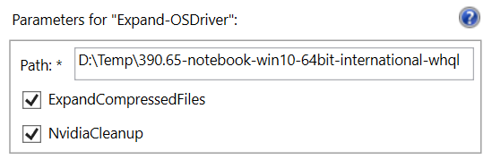
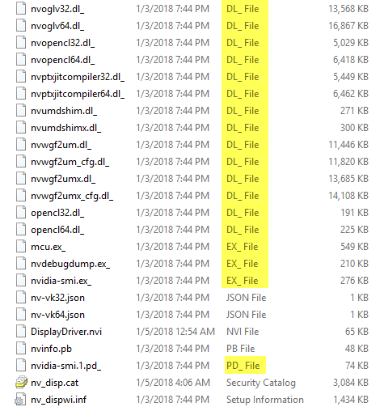

# Expand-OSDriver

In some cases, Drivers will be compressed. Nvidia likes to do this with their Drivers to save space. You can read about this on my Nvidia Video Drivers page.

[https://www.osdeploy.com/drivers/download-hardware-drivers/nvidia-video-drivers/](https://www.osdeploy.com/drivers/download-hardware-drivers/nvidia-video-drivers/)

Expand-OSDriver will expand and rename the files as well as giving the option to remove some unnecessary Nvidia files.



## -Path

This is the directory of the Drivers you want to expand. If you have multiple Directories, this can be used on the Parent Directory as well.

## -ExpandCompressedFiles

Selecting this option will expand these files and rename them with their proper extension



If you require further reading on this method, see this link

[https://technet.microsoft.com/en-us/library/cc938939.aspx](https://technet.microsoft.com/en-us/library/cc938939.aspx)

## -NvidiaCleanup

When selecting the NvidiaCleanup switch, the following directories will be removed to save space as they contain no Drivers

```text
"Display.NView",
"Display.Optimus",
"Display.Update",
"DisplayDriverCrashAnalyzer",
"GFExperience",
"GFExperience.NvStreamSrv",
"MSVCRT",
"nodejs",
"NV3DVision",
"NvBackend",
"NvCamera",
"NvContainer",
"NVI2",
"NvTelemetry",
"NVWMI",
"PhysX",
"ShadowPlay",
"Update.Core"
```

## Example

In the Example pictured at the top of this page, the initial extracted size with compressed files was 1.09 GB. After running -ExpandCompressedFiles the size increased to 1.30 GB.

The NvidiaCleanup switch cleared enough space to make this Driver .59 GB.

```text
***** Calculating Path Size *****
***** Removing Directories Named Display.NView *****
***** Removing Directories Named Display.Optimus *****
***** Removing Directories Named Display.Update *****
***** Removing Directories Named DisplayDriverCrashAnalyzer *****
***** Removing Directories Named GFExperience *****
***** Removing Directories Named GFExperience.NvStreamSrv *****
***** Removing Directories Named MSVCRT *****
***** Removing Directories Named nodejs *****
***** Removing Directories Named NV3DVision *****
***** Removing Directories Named NvBackend *****
***** Removing Directories Named NvCamera *****
***** Removing Directories Named NvContainer *****
***** Removing Directories Named NVI2 *****
***** Removing Directories Named NvTelemetry *****
***** Removing Directories Named NVWMI *****
***** Removing Directories Named PhysX *****
***** Removing Directories Named ShadowPlay *****
***** Removing Directories Named Update.Core *****
***** Calculating Path Size *****
Initial Size:     1.09 GB
Expanded Size:     1.30 GB
De-Junked Size:     0.59 GB
```

This is ready to be imported into MDT or ConfigMgr. If you are using this with OSDrivers, converting this to a High Compression CAB will only use 250 MB of space.

