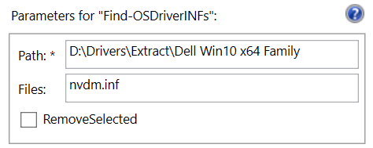
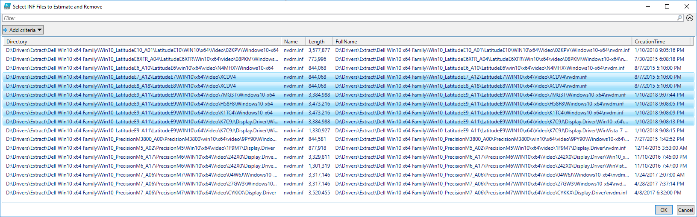

# Find-OSDriverINFs

Lists all INF files in a given path. Helpful in finding duplicate Drivers. Option to Delete the directories if they are not needed.



## -Path

The Path to your Drivers that you want to search through

## -Files

File that you want to search for. If you leave this blank, it will list \*.inf by default.

## -RemoveSelected

Selecting this option will delete the Directory that the selected file was located in

## Example

Once executed, you will be presented a list of results. Simply select the files you want to include and press OK



The directories will be calculated, with a total estimate of how much space can be recovered if they were to be deleted.

```text
PS C:\Windows\system32> Find-OSDriverINFs -Path "D:\Drivers\Extract\Dell Win10 x64 Family" -Files nvdm.inf
***** Calculating Size of D:\Drivers\Extract\Dell Win10 x64 Family *****
246.80 MB D:\Drivers\Extract\Dell Win10 x64 Family\Win10_LatitudeE7_A12\LatitudeE7\WIN10\x64\Video\XCDV4
246.80 MB D:\Drivers\Extract\Dell Win10 x64 Family\Win10_LatitudeE8_A18\LatitudeE8\WIN10\x64\Video\XCDV4
319.54 MB D:\Drivers\Extract\Dell Win10 x64 Family\Win10_LatitudeE9_A11\LatitudeE9\WIN10\x64\Video\H58F8\Windows10-x64
262.26 MB D:\Drivers\Extract\Dell Win10 x64 Family\Win10_LatitudeE9_A11\LatitudeE9\WIN10\x64\Video\K7C9J\Display.Driver\Win10_x64
319.54 MB D:\Drivers\Extract\Dell Win10 x64 Family\Win10_LatitudeE9_A11\LatitudeE9\WIN10\x64\Video\K1TC4\Windows10-x64
275.63 MB D:\Drivers\Extract\Dell Win10 x64 Family\Win10_LatitudeE9_A11\LatitudeE9\WIN10\x64\Video\7MG3T\Windows10-x64
Repository Size:  73.37 GB
1.63 GB can be recovered
```

