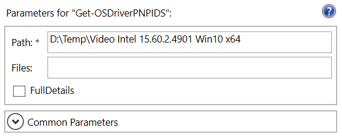
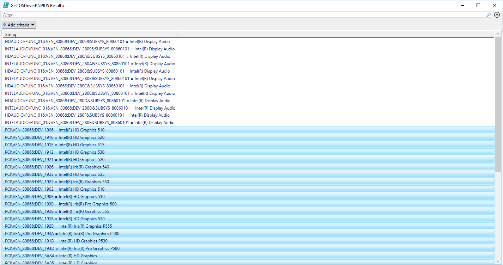
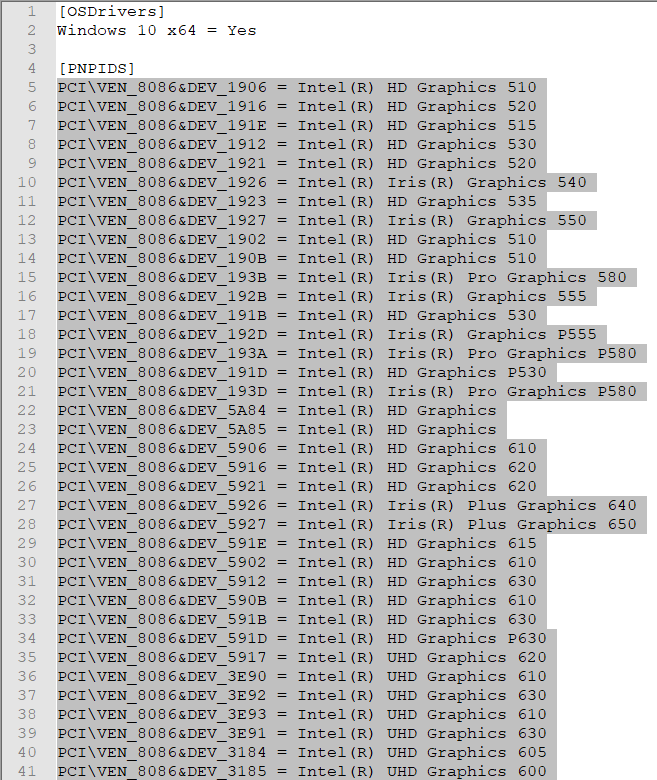
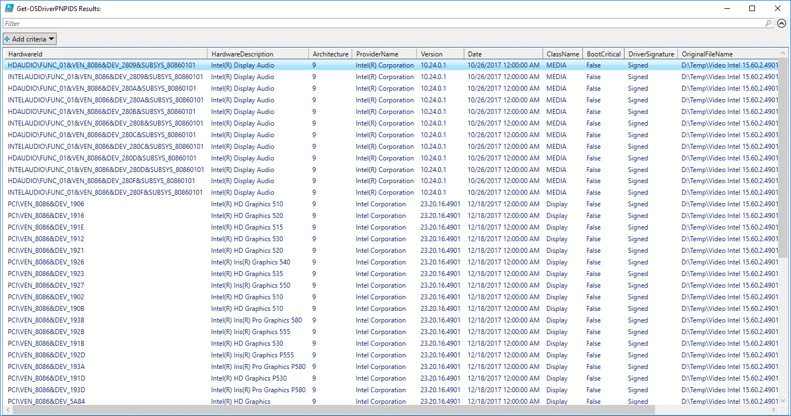
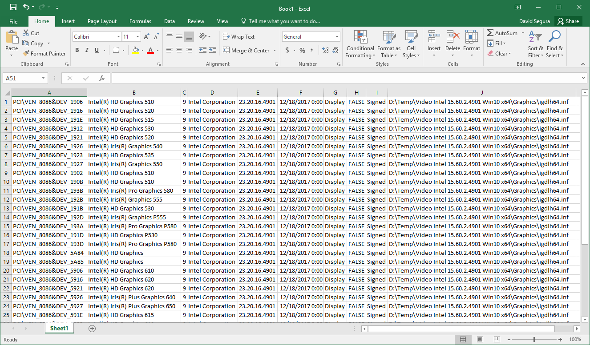

# Get-OSDriverPNPIDS

This function is used to gather the PNPIDS from INF files.

## -Path

Enter a path to search for Driver INF files. All subdirectories are processed

## -Files

By default, this function will search for \*.inf files, there is no need to specify anything. If you want to search for a particular file, just enter it by name, like **nvdm.inf**. You can use a wildcard like **nv\*.inf** as well.

## -FullDetails

By default, the PNPID and the Hardware Description are returned, ready to copy in an OSDriver.txt configuration file. Checking the Full details will display more information. Results can be copy and pasted into Excel.

## Example

### Get-OSDriverPNPIDS -Path "D:\Temp\Video Intel 15.60.2.4901 Win10 x64"

The results will open in a Grid in a Hardware ID = Hardware Description format.

You can select the entries you want and paste in Notepad. In the case of Video drivers, you should never select the Audio as most of the Hardware ID's are shared between different Drivers.

## Example with Full Details

### Get-OSDriverPNPIDS -Path "D:\Temp\Video Intel 15.60.2.4901 Win10 x64" -FullDetails

Everything you wanted to know about the supported hardware in a Driver.

The data pastes quite easily in Excel

