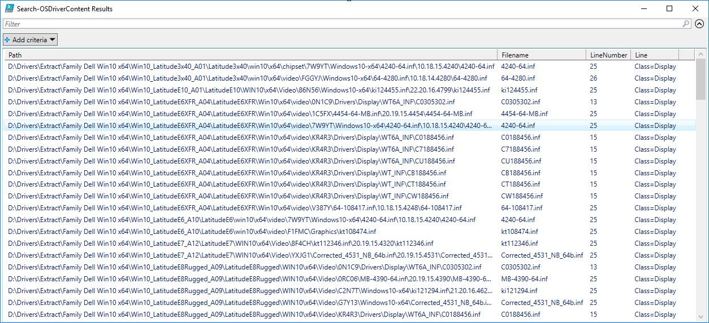
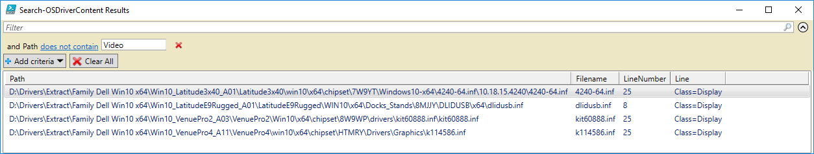

# Search-OSDriverContent

This function will search all INF Files in a given Path for the specified Content

## -Path

The Path to your Drivers that you want to search. This will search recursively.

## -Content

The string you want to search for

## -Files

By default this is \*.inf

## Example

Using the example image above as the parameters, all INF Files will be processed and all matches will be returned with a File Name and Line Number that the Content was located.

The nice thing is that the Results in Grid View can be filtered \(top\)

