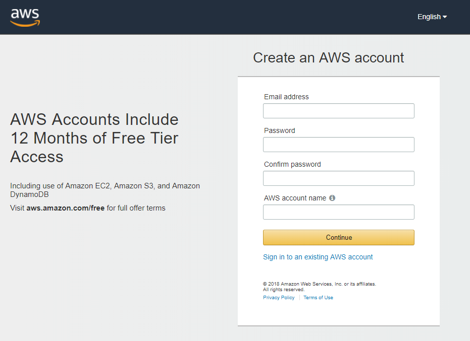
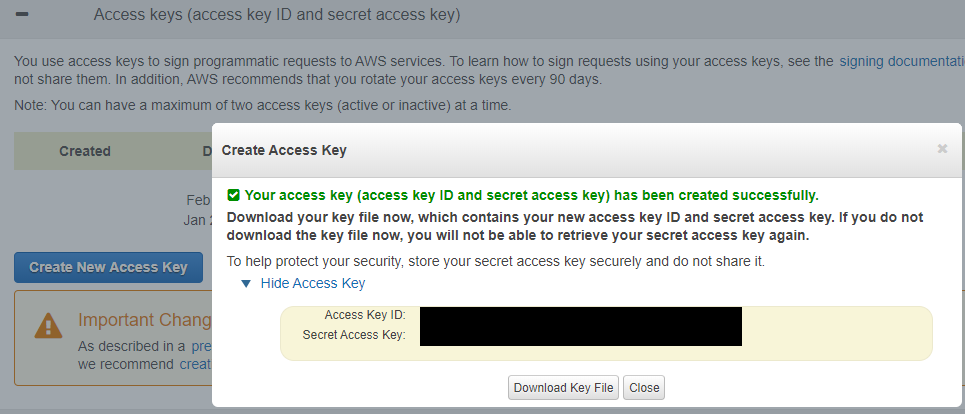

# Amazon AWS

I have Published an OSDrivers Dell Repository on Amazon AWS. You are free to use this as an Sample, but you will need to have an AWS Account created for Authentication.

## Create an AWS Account

Create an AWS Account by completing the following.

[https://portal.aws.amazon.com/billing/signup\#/start](https://portal.aws.amazon.com/billing/signup#/start)



[https://docs.aws.amazon.com/general/latest/gr/managing-aws-access-keys.html](https://docs.aws.amazon.com/general/latest/gr/managing-aws-access-keys.html)

## Generate Access Keys

Once you have created your AWS Account, you can Generate Access Keys

[https://console.aws.amazon.com/iam/home?\#/security\_credential](https://console.aws.amazon.com/iam/home?#/security_credential)

Create New Access Key to generate an Access Key ID and a Secret Access Key. Save these numbers!



[https://docs.aws.amazon.com/powershell/latest/userguide/pstools-getting-set-up-windows.html](https://docs.aws.amazon.com/powershell/latest/userguide/pstools-getting-set-up-windows.html)

## Install AWS Tools for PowerShell

Open PowerShell as Administrator. Make sure that your Script Execution Policy allows you to install the Module first

```text
PS C:\> Install-Module -Name AWSPowerShell
```

[https://docs.aws.amazon.com/powershell/latest/userguide/pstools-appendix-sign-up.html](https://docs.aws.amazon.com/powershell/latest/userguide/pstools-appendix-sign-up.html)

## Configure AWS Account and Access Key

Once the AWSPowerShell module is installed, save your Amazon AWS Keys in PowerShell

```text
PS C:\> Set-AWSCredential -AccessKey <Access Key ID> -SecretKey <Secret Access Key> -StoreAs default
```

