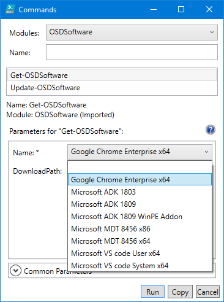
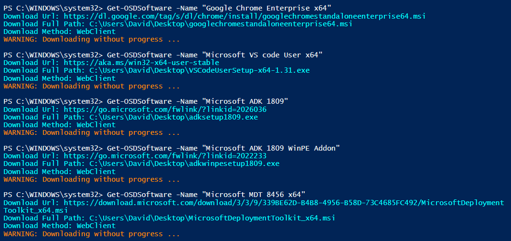
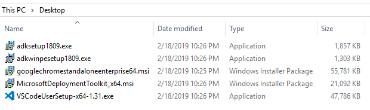
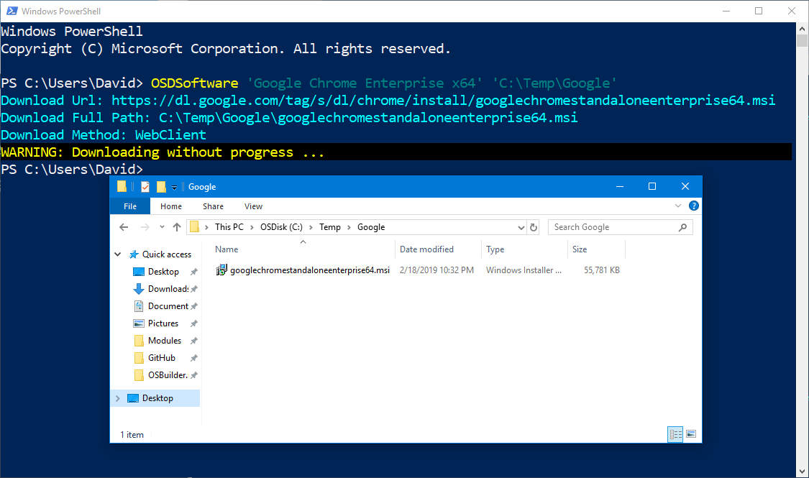

# Get-OSDSoftware

## Function

```text
<#
.SYNOPSIS
Download software related to OS Deployment

.DESCRIPTION
Download software related to OS Deployment, including the ADK and MDT

.LINK
https://www.osdeploy.com/osdsoftware/docs/functions/get-osdsoftware

.PARAMETER Name
Name of the software to download

.PARAMETER DownloadPath
This is the path to download the updates

.EXAMPLE
Get-OSDSoftware -Name 'Google Chrome Enterprise x64' -DownloadPath C:\Temp
Downloads googlechromestandaloneenterprise64.msi to C:\Temp
Alternatively, use the shorter command line
OSDSoftware 'Google Chrome Enterprise x64' C:\Temp
#>
```

## Get-OSDSoftware -Name

The Name parameter is the Software to download.  In PowerShell ISE you can select from a list



In PowerShell, a Control+Space will allow you to select


Software will be downloaded automatically



Saved to the Desktop by default



## Get-OSDSoftware -DownloadPath

This allows you to specify the location for the download

## Shorthand

There is no need to use Get-.  Additionally the parameters are positional.  To download Google Chrome to C:\Temp, use the following command

```text
OSDSoftware 'Google Chrome Enterprise x64' 'C:\Temp\Google'
```

Google Chrome Enterprise will be downloaded to C:\Temp\Google with the directories being created if necessary



