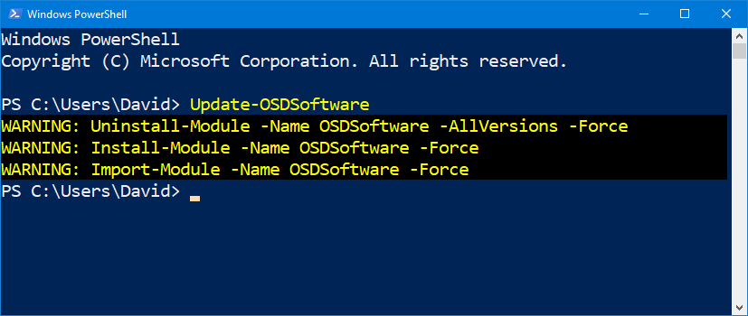

# Update-ModuleOSDSoftware

## Function

```text
<#
.SYNOPSIS
Updates the OSDSoftware PowerShell Module to the latest version

.DESCRIPTION
Updates the OSDSoftware PowerShell Module to the latest version from the PowerShell Gallery

.LINK
https://www.osdeploy.com/osdsoftware/docs/functions/update-moduleosdsoftware

.Example
Update-ModuleOSDSoftware
#>
```

## Usage

**Update-OSDSoftware** will remove previous Module versions and install the latest OSDSoftware Module.  There are no parameters




