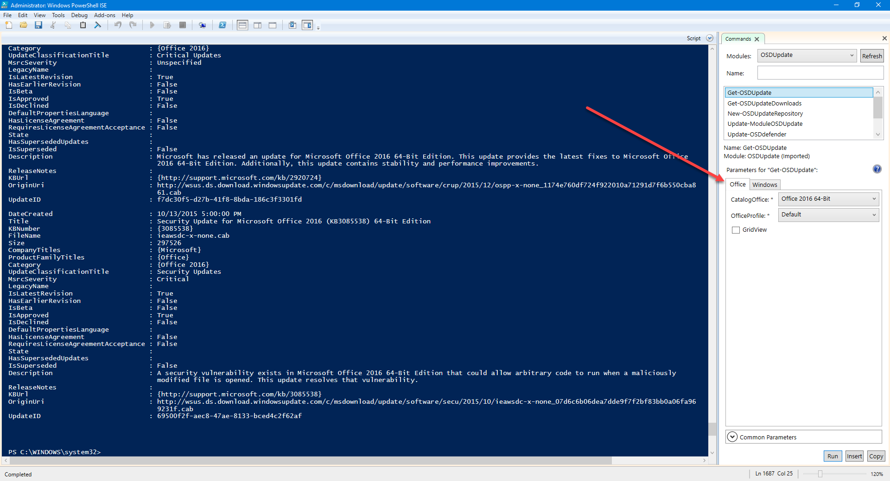
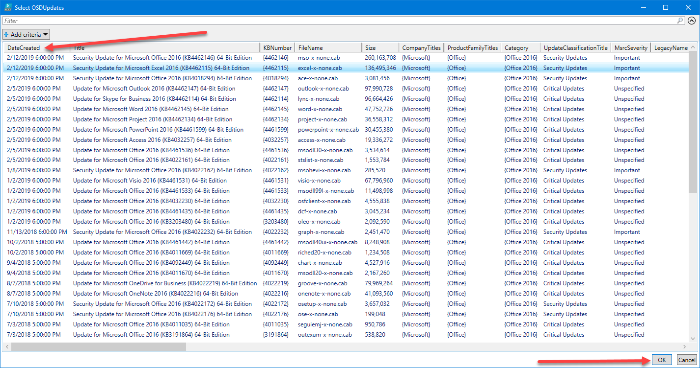
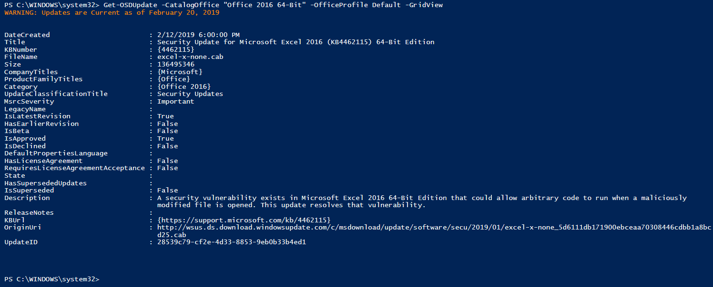
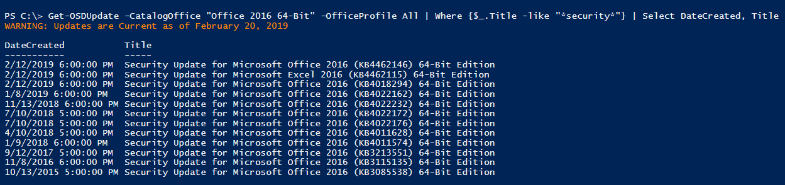
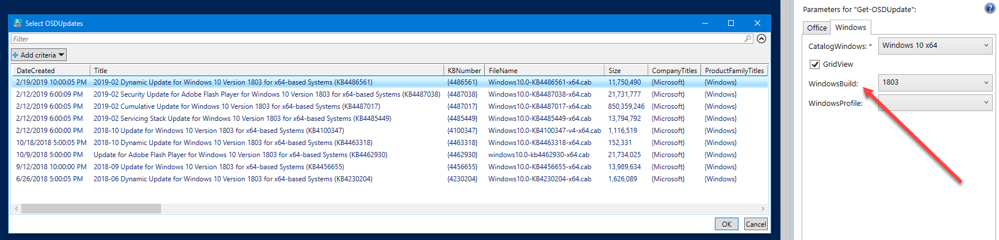
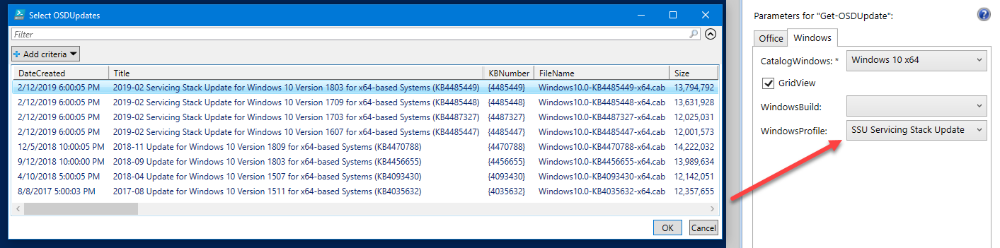

# Get-OSDUpdate

**Get-OSDUpdate returns a list of Microsoft Windows and Office Updates**

## Comment Based Help

```text
<#
.SYNOPSIS
Gets Current Microsoft Updates

.DESCRIPTION
Gets Current Microsoft Updates

.LINK
https://www.osdeploy.com/osdupdate/docs/functions/get-osdupdate

.PARAMETER CatalogOffice
The Microsoft Office Update Catalog selected for Updates

.PARAMETER OfficeProfile
Microsoft Office Update Type

.PARAMETER CatalogWindows
The Microsoft Windows Update Catalog selected for Updates

.PARAMETER UpdateArch
Architecture of the Update

.PARAMETER UpdateBuild
Windows Build for the Update

.PARAMETER UpdateGroup
Windows Update Type

.PARAMETER GridView
Displays the results in GridView with -PassThru

.PARAMETER Silent
Hides the Warnings
#>
```

## Usage

If you are new to PowerShell, I strongly recommend using PowerShell ISE when running it.  You start by selecting either Office or Windows \(Parameter Set\).  For Office, you will need to select a Catalog \(which is your Office version\) and an OfficeProfile, which sorts the updates into some basic Selection Profiles

When executing, the results with full details are returned



## GridView

This Parameter will allow you to see the results in GridView format.  This uses PassThru which means that when you select one or more updates and press OK, those items are Returned





## Scripting

You can use Get-OSDUpdate to find specific results to find the current Security Updates



## Windows

For Windows, you can get granular on Windows Build



Or see all the Servicing Stacks for Windows 10



## That's It

Nothing more, nothing less.  Use this function so you can custom filter Windows and Office Updates and do whatever you want with it

