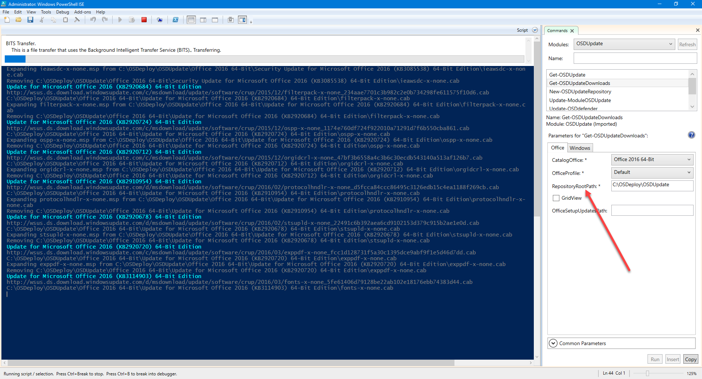
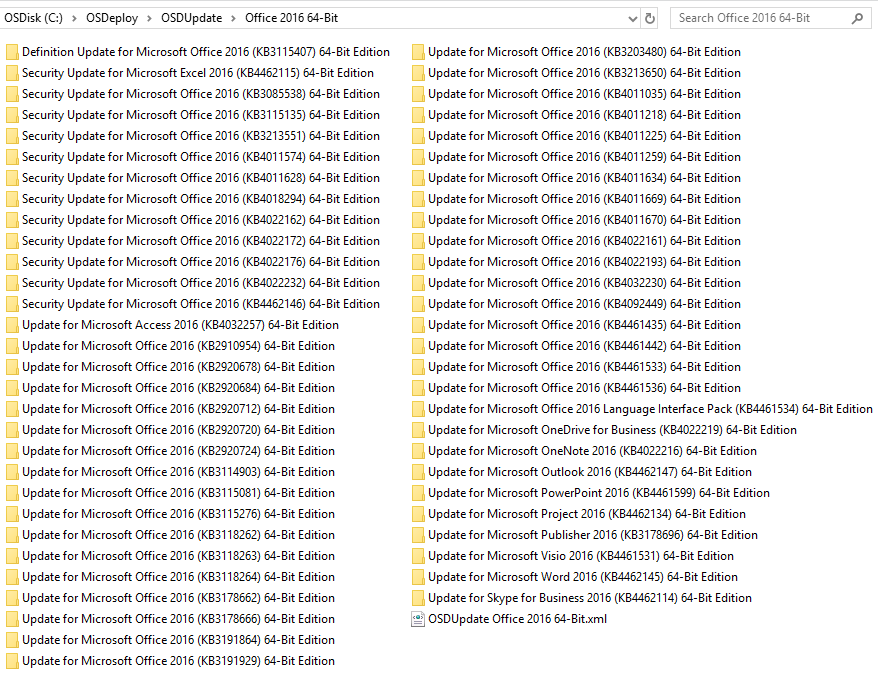
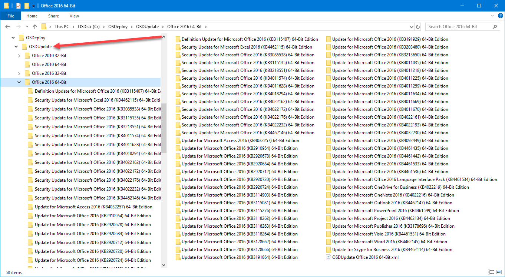

# Get-OSDUpdateDownloads

**This function is just like Get-OSDUpdate, but adds a Download capability**

## OSDUpdate Repository

You need to specify a Repository Root Path for this function to work.  Again, I recommend working with GridView if you are new, but with the following PowerShell Command like, all Default Office 2016 64-Bit Updates will be automatically downloaded

```text
Get-OSDUpdateDownloads -CatalogOffice "Office 2016 64-Bit" -OfficeProfile Default -RepositoryRootPath C:\OSDeploy\OSDUpdate
```



## Download Results

And here are the results of the download



Use the same RepositoryRootPath, and all downloads are will be separated by Catalog



## Updating Microsoft Office Updates

Specifying an OfficeSetupUpdatesPath will copy the proper MSP files to your Office installation package


