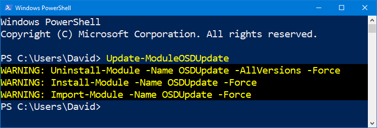

# Update-ModuleOSDUpdate

## Function

```text
<#
.SYNOPSIS
Updates the OSDUpdate PowerShell Module to the latest version

.DESCRIPTION
Updates the OSDUpdate PowerShell Module to the latest version from the PowerShell Gallery

.LINK
https://www.osdeploy.com/osdupdate/docs/functions/update-moduleosdupdate

.Example
Update-ModuleOSDUpdate
#>
```

## Usage

**Update-ModuleOSDUpdate** will remove previous Module versions and install the latest OSDUpdate Module.  There are no parameters



