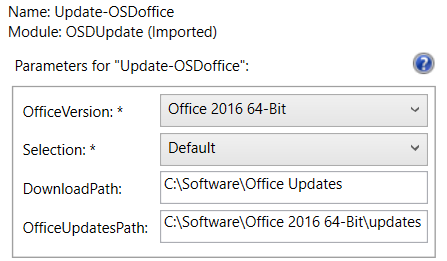

# Microsoft Office 2016 Updates

## CollectUpdates.vbs

You are probably used to using Microsoft's **CollectUpdate.vbs** for keeping your Office Updates directory current but this requires the following steps:

1. **Create Test Computer**
2. **Install Office**
3. **Update Office \(WSUS, SCCM, Windows Update\)**
4. **Gather Updates using CollectUpdates.vbs**



If you are in an environment that supports multiple Versions and Architectures of Microsoft Office, you will need to repeat this process for each Office Version/Architecture

## Update-OSDoffice

Thie **Update-OSDoffice** PowerShell script should make things significantly easier for you.  Here's how it works.

## Update-OSDoffice Parameters

Let's get some parameters out of the way first

* **OfficeVersion**
  * Select the Microsoft Office version you are working with.  In this case I have selected Office 2016 64-Bit
* **Selection**
  * This is also known as a Selection Profile.  The default is configured for en-US, but you can start with this Selection and change later
* **DownloadPath**
  * The updates are in CAB format and must be expanded to MSP files, so consider this a Repository.  This directory should NOT be part of your package, but saving files in here will speed up re-downloading Updates in the future
* **OfficeUpdatesPath**
  * This is the Updates Directory in your Microsoft Office installation.  MSP files placed in this directory \(root\) will be applied during your Microsoft Office installation

