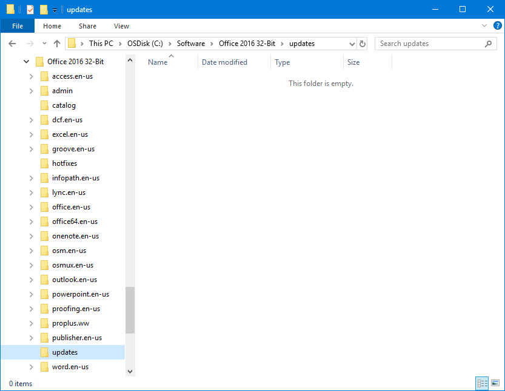
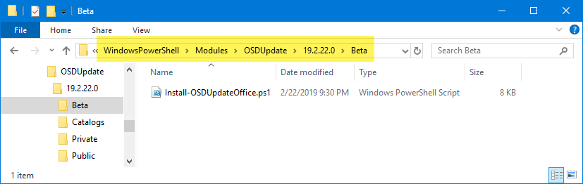
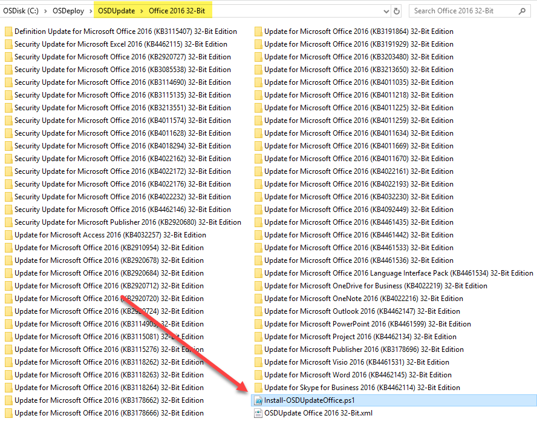
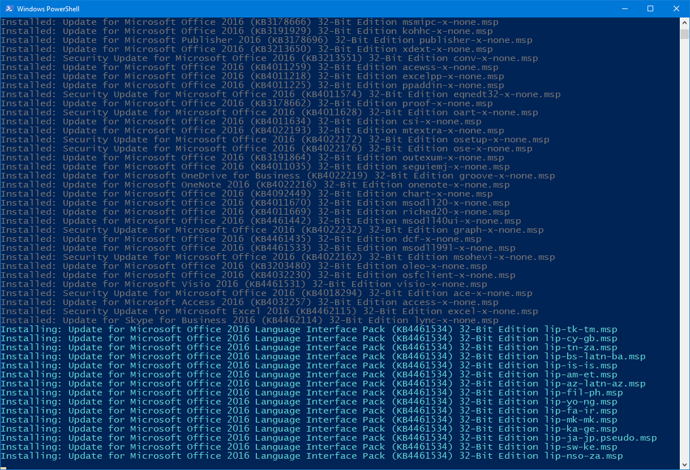

# Microsoft Office MSP Install Script

**If you want to deploy Microsoft Office fully patched the fastest way possible, you are going to want to follow this process**

## Office Installation Source

In your Office installation, you have a directory called updates.  This is typically where you put the latest Office Update MSP files.  Remove any Office Update MSP file in there \(you can leave your custom MSP to install Office that you created with the Office Customization Tool\)

## Download OSDUpdate Office Updates

Download all your necessary updates using **Get-OSDUpdateDownloads**



## Office MSP Install Script

Create a custom script to install the MSP files.  There is an example script that has been added to the OSDUpdate PowerShell Module in the Beta directory

Add this script to the directory that contains your Office Updates for your Office Version.  This directory is now ready to be deployed using the PowerShell Script for installation

## Deployment

The PowerShell script will go through the updates and install them in the proper order

## Results

This is the quickest method to deploy a fully patched Office installation.  Keep in mind that the installation script is in development and should be used for testing only

