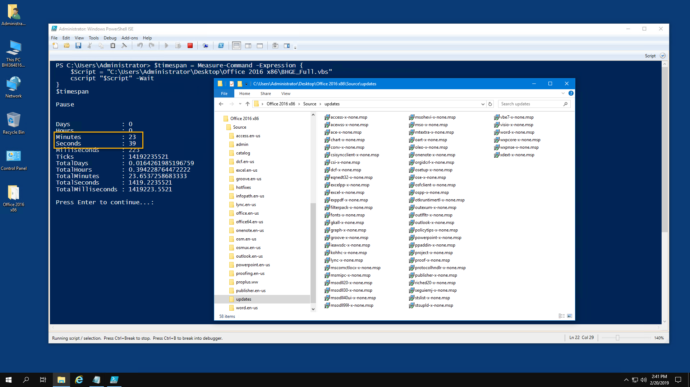
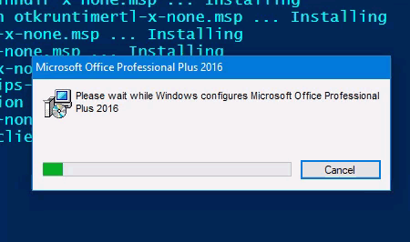
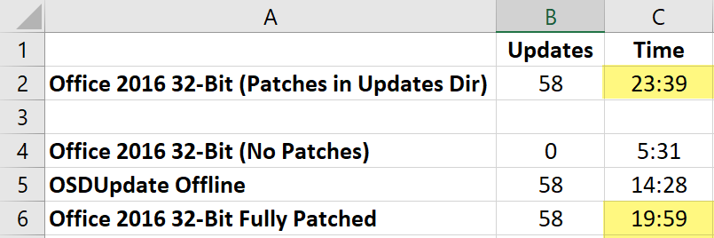

# Office Deployment and OSDUpdate

The first good use for **OSDUpdate** has been to patch an Office installation source with the latest updates.  This method has been a common practice since **CollectUpdates.vbs** was introduced ages ago

While this method is the "Best Practice", it is not the fastest method of Office 2016 deployment.  All testing in this Guide was in a clean Windows 10 Virtual Machine \(2 Cores, 8GB RAM\) with all content local in the VM.  All times were recorded using PowerShell `Measure-Command`


**If you aren't interested in a faster way to install Office, get back to Twitter ASAP**


## Install Office 2016 32-Bit \(All Updates\)


**23 minutes 39 seconds \(includes 58 Updates\)**


In this test, the Office Updates directory was fully patched with the latest updates using **OSDUpdate**.  This is the method used by most everybody when deploying Office



## Install Office 2016 32-Bit \(No Updates\)


**5 minutes 31 seconds \(includes 0 Updates\)**


This may come as a total shock, but removing all updates from the Office Updates directory results in a deployment time that is **18 minutes faster**.  Unfortunately this results in a system that must get Updates from SCCM or WSUS, which will undoubtedly take longer than 18 minutes

## OSDUpdate Post Installation


**This method has not been released yet,  Stay tuned**


Instead of using SCCM or WSUS to update Office after an Office deployment sans Updates, running the updates in a Post Install process will be considerably quicker.  This method involves installing the MSP Updates using the following command line in a `foreach` loop

```text
msiexec /p "$($Update.FullName)" /qr REBOOT=ReallySuppress MSIRESTARTMANAGERCONTROL=Disable
```



And here's the results


**14 minutes and 28 seconds \(includes 58 Updates\)**


## Conclusion

If you are mathematically challenged, here's a picture to explain this conclusion.  Installing the updates as a Office Post Install is 3 minutes and 47 seconds \(18%\) faster than including the updates in the Office Updates directory.



## Package Consideration

Office 2016 alone is about 825MB, with the 58 updates consuming 1.02GB.  Having these two combined results in a 1.83GB Package that changes monthly.

Separating Office from the Updates will allow the 825MB Office 2016 32-Bit package to remain static, never needing updates \(which helps with replication\), while the Updates Package will be the one that changes.  **Food for thought**


