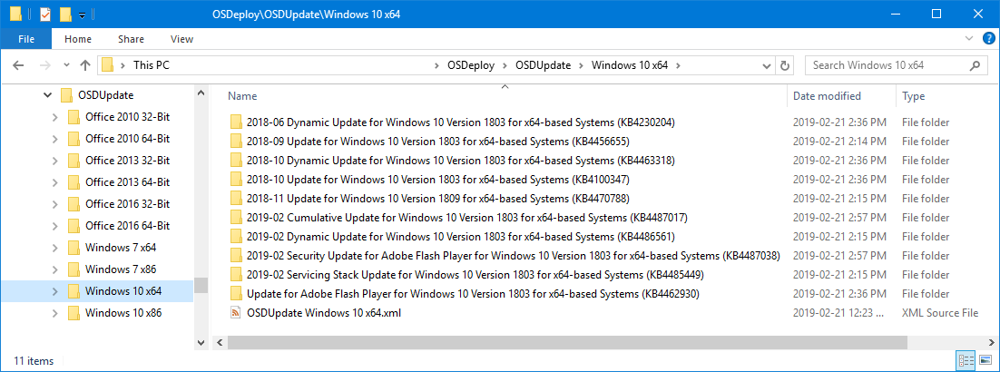

# 2019-02

## 19.2.22 \(February 22, 2019\)

Updated Catalogs and included a BETA PowerShell Script for installing Office MSP files

## 19.2.21 \(February 21, 2019\)


**Documentation will be in the next day or so, lots of changes in this release**


* **Get-OSDUpdate** - New function to return all current Microsoft Updates
  * **GridView** - Displays the results in GridView with PassThru for easy selection
  * **Office Parameter Set**
    * CatalogOffice - Office Version and Architecture
    * OfficeProfile - Office Update Selection Profile
  * **Windows Parameter Set**
    * CatalogWindows - Windows Version and Architecture
    * WindowsBuild - Filters results based on Windows Build
    * WindowsProfile - Windows Update Selection Profile
* **Get-OSDUpdateDownloads** - Replaces Update-OSDoffice and Update-OSDwindows
  * **RepositoryRootPath** - Path to store the downloads.  Recommended is C:\OSDUpdate or similar.  Child directories will be created automatically
  * **GridView** - Displays the results in GridView with PassThru for easy selection
  * **Office Parameter Set**
    * CatalogOffice - Office Version and Architecture
    * OfficeProfile - Office Update Selection Profile
    * OfficeSetupUpdatesPath - Full Path to &lt;Office Setup Package&gt;\Updates for MSP files.  This is optional
  * **Windows Parameter Set**
    * CatalogWindows - Windows Version and Architecture
    * WindowsBuild - Filters results based on Windows Build
    * WindowsProfile - Windows Update Selection Profile
* **New-OSDUpdateRepository** - New function to create the initial OSDUpdate Repository.  This is not required and will be created automatically as needed

## 19.2.19 \(February 19, 2019\) Initial Release

* **Update-ModuleOSDUpdate**
* **Update-OSDdefender**
  * Defender Definitions
* **Update-OSDmcafee**
  * Mcafee SuperDAT v2
  * McAfee SuperDAT v3
  * McAfee GetSusp
  * McAfee Stinger
* **Update-OSDoffice**
  * Microsoft Office 2010 \(32-Bit and 64-Bit\)
  * Microsoft Office 2013 \(32-Bit and 64-Bit\)
  * Microsoft Office 2016 \(32-Bit and 64-Bit\)
* **Update-OSDwindows**
  * Microsoft Windows 10
  * Microsoft Windows Server 2012 R2
  * Microsoft Windows Server 2016
  * Microsoft Windows Server 2019

