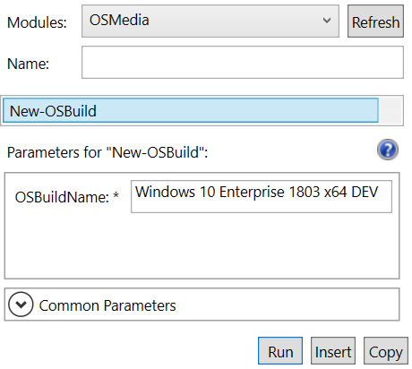
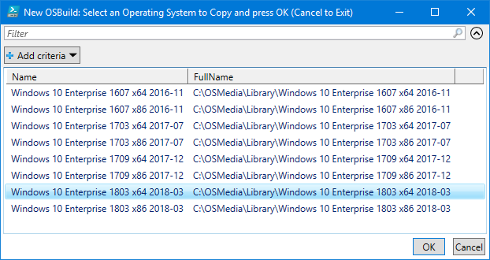
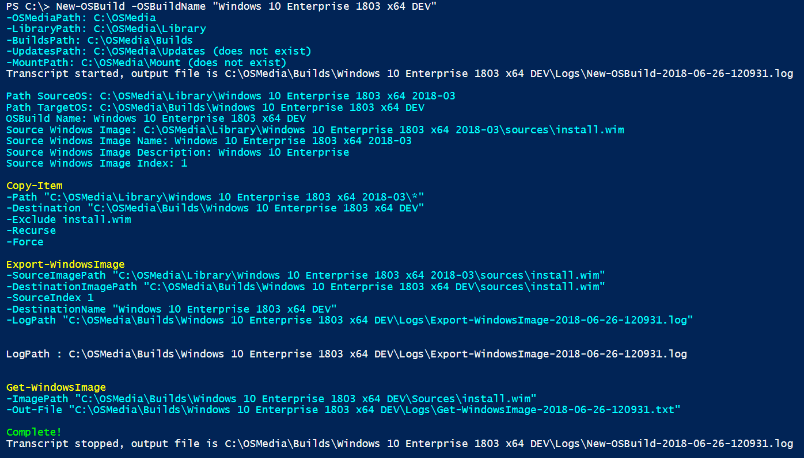
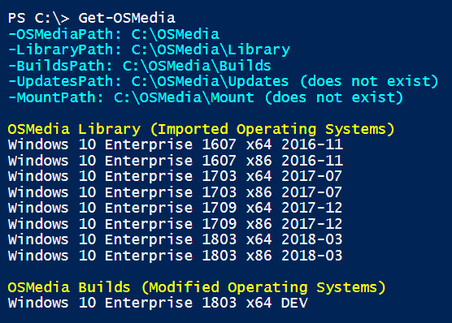
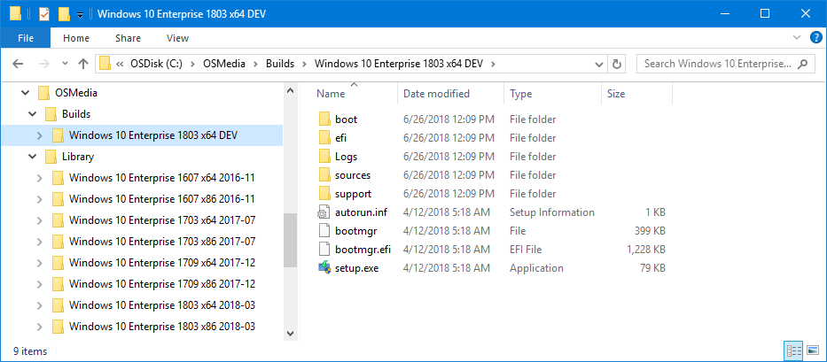

# Create an Operating System Build

**Reference:**  
[New-OSBuild](../reference/new-osbuild.md)

An Operating System Build is Windows Image that will be Updated or Edited since I should not make changes to a Library Operating System \(as those are intended for unmodified Windows Images\)

In PowerShell ISE, select New-OSBuild and enter the OSBuildName as **Windows 10 Enterprise 1803 x64 DEV** and press Run

## Select OSMedia to Copy

Select an existing Operating System to copy from the OSMedia in the Library and press OK

## PowerShell Output

Pay attention to the Console output for any issues, but this is a relatively simple process. Make sure to check the Logs to confirm that everything processed properly.

## Get-OSMedia

The new Build will be listed when running Get-OSMedia

## Complete

Once PowerShell is complete, the copied Operating System will be in the OSMedia Builds directory

