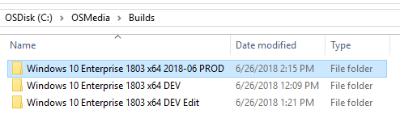

# Edit an Operating System Build

**Reference:**  
[New-OSBuild](../reference/new-osbuild.md)  
[Edit-OSBuild](../reference/edit-osbuild.md)

This How To will detail the steps involved to Remove AppxPackages and add DotNet 3.5 to a Windows Image

## New-OSBuild

Start by creating a new Operating System Build. In this example I am going to create a new OSMedia Build from the one I updated in [Update an Operating System Build](update-an-operating-system-build.md)

```text
New-OSBuild -OSBuildName "Windows 10 Enterprise 1803 x64 DEV Edit"
```

I will have to select the OSMedia to use as my reference


And wait for it to build out


## Edit-OSBuild

In this example the Action will be "**Stay Mounted**'. This will allow us to go through the Edit-OSMedia process repeatedly without saving to mount and dismount the Windows Image.


## Select the Operating System Build to Edit

Select the Operating System Build to edit and press OK. Library Operating Systems are not visible and should not be edited


## Export and Mount

The Windows Image will be exported to a temp.wim and then mounted.


## -ManageAppxPackages

Selecting this option will display a grid of all currently installed Appx Packages. Select the ones you want to remove and press OK.


Every Appx Package that was selected will be removed


## -ManageCapabilities

Selecting this parameter will display all the installed Windows Capabilities, allowing you to select and remove as needed. I do not suggest removing any of these Capabilities. Press Cancel if you decide to not remove anything.


## -ManageFeatures

This parameter will display a list of ENABLED Windows Features that can be selected and DISABLED.


As well as DISABLED Windows Features that can be ENABLED


## -ManagePackages

Windows Packages will be displayed and can be selected for Removal


## -ApplyNetFX3

Selecting this parameter will install .NET 3.5 in your Windows Image. This Package will cause the Windows Image to have Pending Operations, so you will not be able to Start Component Cleanup after installing the package.


## -Action "Stay Mounted"

Since the Action Parameter was set to "Stay Mounted", the Windows Image is not dismounted. This allows Edit-OSBuild to be run additional times without waiting for the Windows Image to Mount / Dismount Save. When all edits are complete, make sure the Action is set to "**Dismount Save**"


## Production Release Build

It is recommended to make a copy for Production, this way the ImageName is set properly. A simple New-OSBuild is all that is needed.

```text
New-OSBuild -OSBuildName "Windows 10 Enterprise 1803 x64 2018-06 PROD"
```


Now take this Operating System and import it into MDT or SCCM and start deploying. You can delete the DEV Builds if they are no longer needed.



