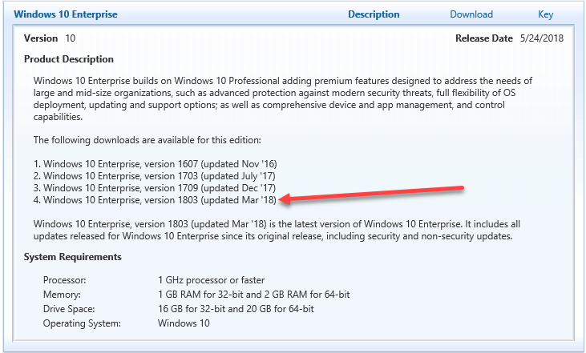
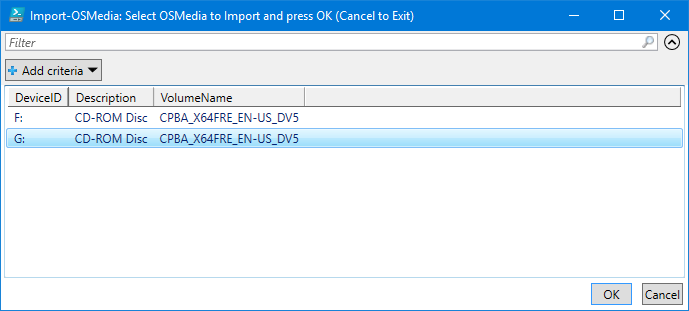
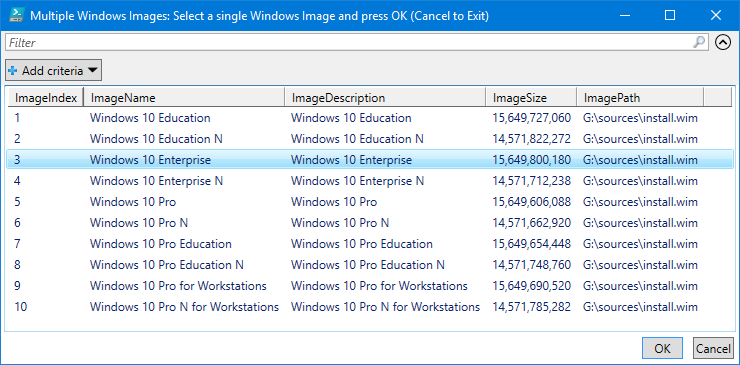
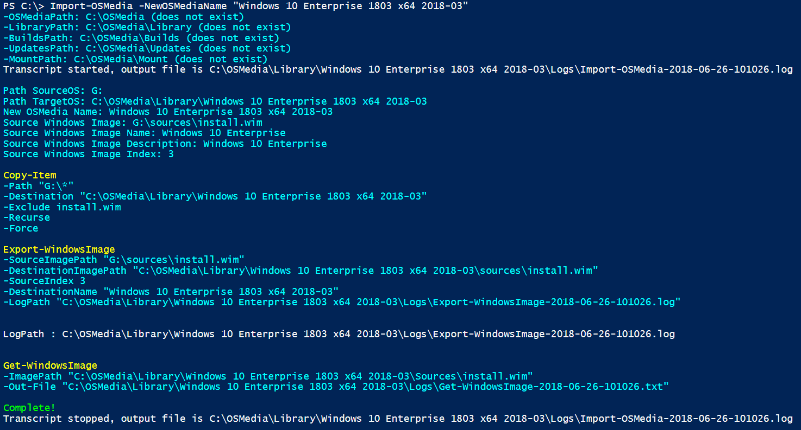
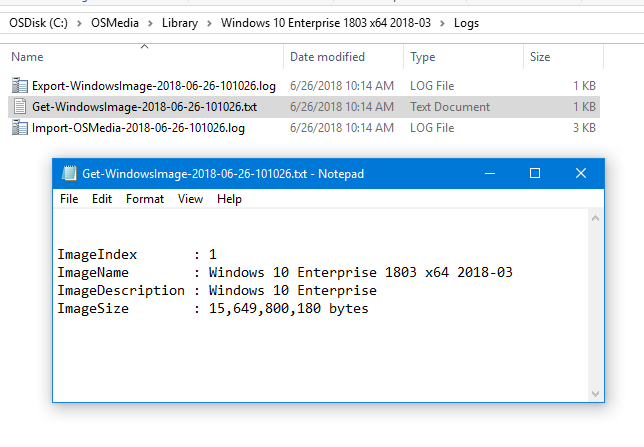
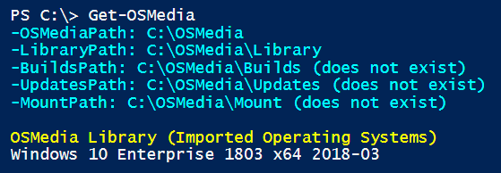

# Import an Operating System

**Reference:**  
[Import-OSMedia](../reference/import-osmedia.md)

This page will detail how to import an Operating System using OSMedia. In this example we will import Windows 10 Enterprise 1803 x64 into the OSMedia Library

## Know Your Update Information

If you download Windows 10 from the Microsoft Volume Licensing Service Center, each download of Windows 10 has an updated date. Make a note of this information.



## Mount Windows 10 1803 x64

Mount the ISO as a Drive, as you normally would in Windows Explorer

## Import-OSMedia

Since each imported Operating System will need to be unique, make sure the updated information is in the NewOSMediaName

```text
Import-OSMedia -NewOSMediaName "Windows 10 Enterprise 1803 x64 2018-03"
```

## Multiple Import Drives

* Import-OSMedia will check Drives for instances of %Drive%\sources\install.wim
* Import will be automatic for single instances of install.wim.  If multiple instances are found, you will be prompted to select the drive to Import



## Multiple Windows Images

After running the PowerShell command, the Operating System Image will be checked for multiple Windows Images within the install.wim. Select a single Operating System to import and press OK.



## PowerShell Output

After Import-OSMedia is complete, the console will display all the information including the PowerShell functions with the Parameters that were used.



## Logs

In each imported Operating System there will be a Logs directory that will contain information about the Windows Image. In the image below, the ImageName has been changed to match the NewOSMediaName parameter.



## Get-OSMedia

The Imported Operating System can be checked with Get-OSMedia



