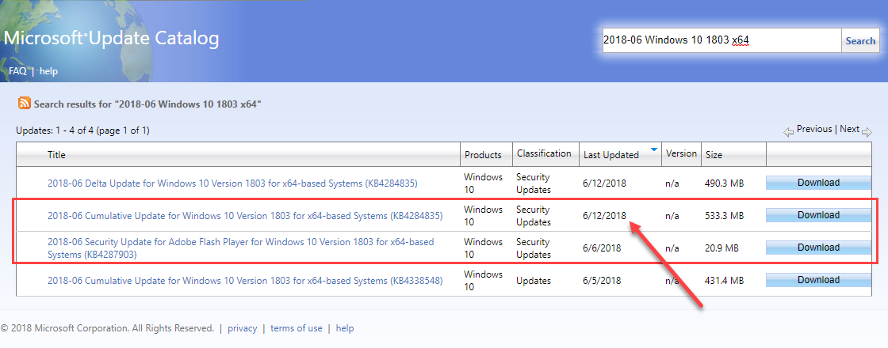
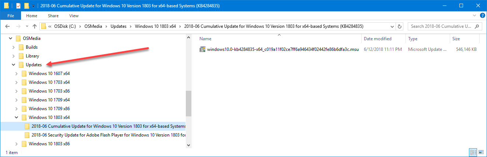
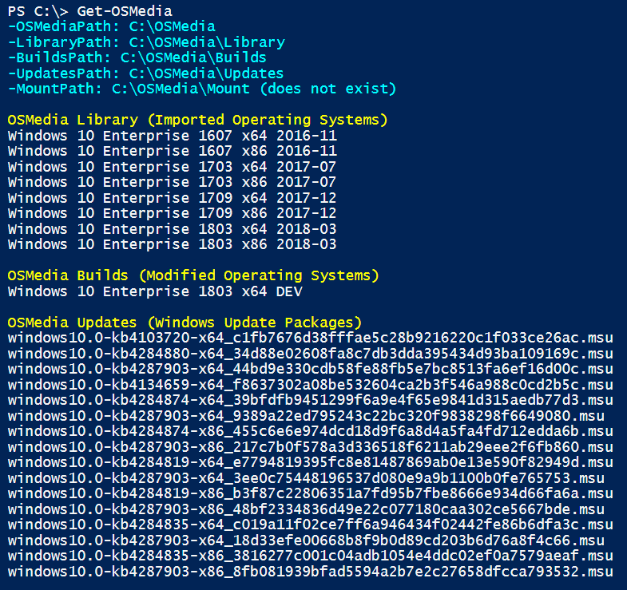
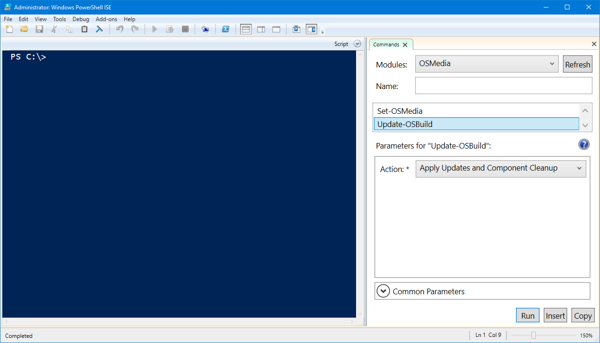
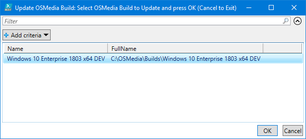
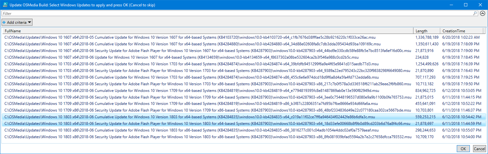
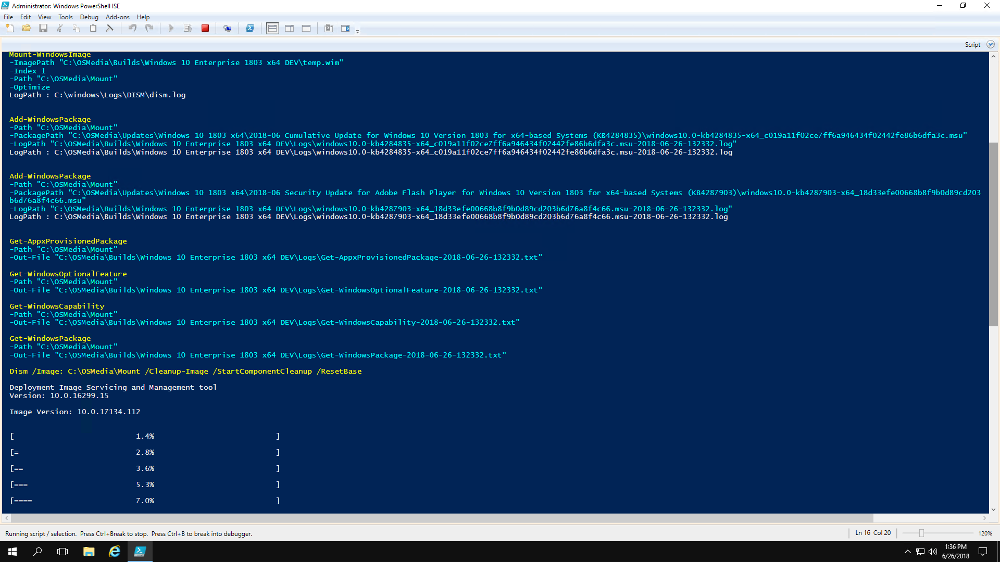
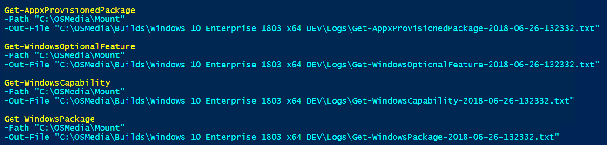
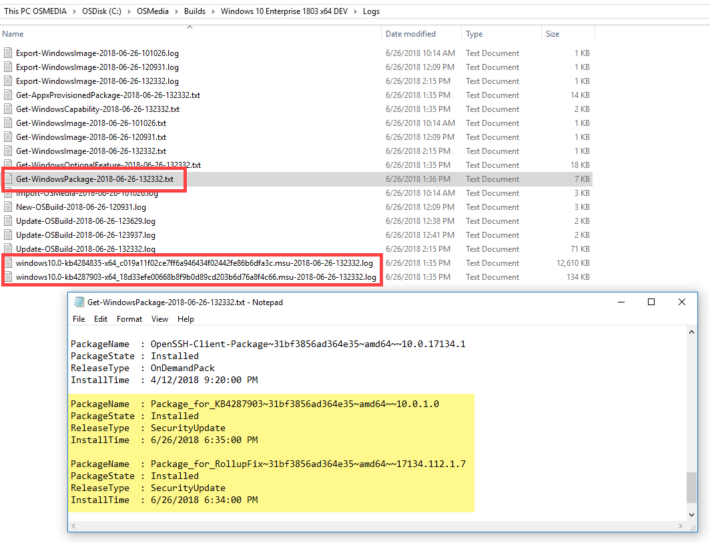

# Update an Operating System Build

**Reference:**  
[Update-OSBuild](../reference/update-osbuild.md)

If you have a copied Operating System in the OSMedia library, it is easy enough to apply some Windows Updates.

## Gather Microsoft Updates

The next step is to gather the Microsoft Updates that we want to add to our OSMedia. Head over to the Microsoft Update Catalog at [https://www.catalog.update.microsoft.com/home.aspx](https://www.catalog.update.microsoft.com/home.aspx)

In the Search Box, enter 2018-06 Windows 10 1803 x64

This will give us the latest updates \(at the time of writing\) for our Windows 10 Enterprise 1803 x64

Pay attention to the date of the newest Cumulative Update if you have multiple. You should also download the Adobe Flash Player update.

## Updates Directory

If you are using the Default paths for OSMedia, then you should download your updates to C:\OSMedia\Updates in any logical structure. Update-OSBuild will recurse the Updates directory for all MSU and CAB files

## Get-OSMedia

Get-OSMedia will return the updates that are found in the OSMedia Updates directory

## Update-OSBuild

I prefer to run this step on a network disconnected Virtual Machine so nothing on my production computer interferes with the process \(like McAfee ...\)

Using PowerShell ISE, select Update-OSBuild. Select the appropriate Action for the Update. Keep in mind that running an Action with Cleanup will take a considerable amount of time. Press Run

## Select OSMedia Build

Select the Operating System Build to update and press OK. Library Operating Systems are not visible and should not be updated

## Select Windows Updates

Once the OSMedia Build is selected, a grid of the available Windows Updates will be displayed. These are files that are in the Updates directory. Select the updates to apply and press OK.

## Execution

Once the updates have been selected the following steps will occur

* Windows Image will be exported to a temp.wim
* Windows Image will be mounted
* Windows Updates will be applied to the Offline Image
* Image Cleanup with /StartComponentCleanup /ResetBase
* Windows Image will be dismounted and saved
* Windows Image will be exported back to install.wim

This process will take a while to run so take a break. When you get back, you will now have an updated OSMedia that you can import into SCCM or MDT.

## Logs

In addition to the PowerShell Transcript that is created in the Logs directory, some additional TXT files are created with information about the Windows Image.

* Get-AppxProvisionedPackage
* Get-WindowsCapability
* Get-WindowsOptionalFeature
* Get-WindowsPackage

Reviewing the **Get-WindowsPackage-\*.txt** file will show the updates that were applied successfully. Additionally there are LOGS for the Windows Updates that were installed.

