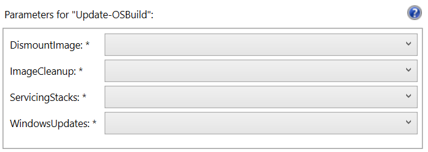

# Update-OSBuild

* 18.06.28 Added Servicing Stacks.  Modified Parameters
* 18.06.26 Initial Release. Replaces [Update-OSMedia](update-osmedia.md)

## Update-OSBuild

This function is used to apply Servicing Stack and Windows Updates and to perform an Image Cleanup

### -DismountImage "Save"

Dismounts and Saves changes to the mounted Windows Image

### -DismountImage "Discard"

Dismounts and Discards changes to the mounted Windows Image

### -DismountImage "Stay Mounted"

Does not dismount the mounted Windows Image. Allows for subsequent changes

### -ImageCleanup "StartComponentCleanup ResetBase"

Performs a DISM Image Cleanup on the mounted Windows Image \(Dism /Cleanup-Image /StartComponentCleanup /ResetBase\)

This step will take a considerable amount of time, but is required to remove updated components

### -ImageCleanup "Skip"

Skips DISM Image Cleanup

### -ServicingStacks "Select"

Allows the selection of a Servicing Stack Update Package for installation in a mounted Windows Image

### -ServicingStacks "Skip"

Skips applying a Servicing Stack Update

### -WindowsUpdates "Select"

Allows the selection of multiple Windows Update Packages for installation in a mounted Windows Image

### -WindowsUpdates "Skip"

Skips applying Windows Update Packages

