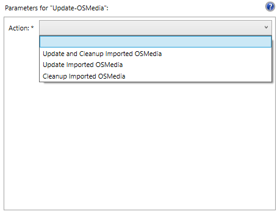

# Depricated: Update-OSMedia

* 18.06.26 This function is removed and has been replaced by [Update-OSBuild](update-osbuild.md)
* 18.06.25 Initial Release

## Update-OSMedia

This function is used to apply Windows Updates and to Cleanup and compress a Windows Image

### -Action "Update and Cleanup Imported OSMedia"

This is a lengthy process that will complete the following

* Mount the Windows Image
* Apply MSU or CAB Windows Update Packages \(PowerShell Add-WindowsPackage\)
* Cleanup the Windows Image \(Dism /Cleanup-Image /StartComponentCleanup /ResetBase\)
* Dismount the Windows Image

### -Action "Update Imported OSMedia"

This is a lengthy process that will complete the following

* Mount the Windows Image
* Apply MSU or CAB Windows Update Packages \(PowerShell Add-WindowsPackage\)
* Dismount the Windows Image

### -Action "Cleanup Imported OSMedia"

This is a lengthy process that will complete the following

* Mount the Windows Image
* Cleanup the Windows Image \(Dism /Cleanup-Image /StartComponentCleanup /ResetBase\)
* Dismount the Windows Image

