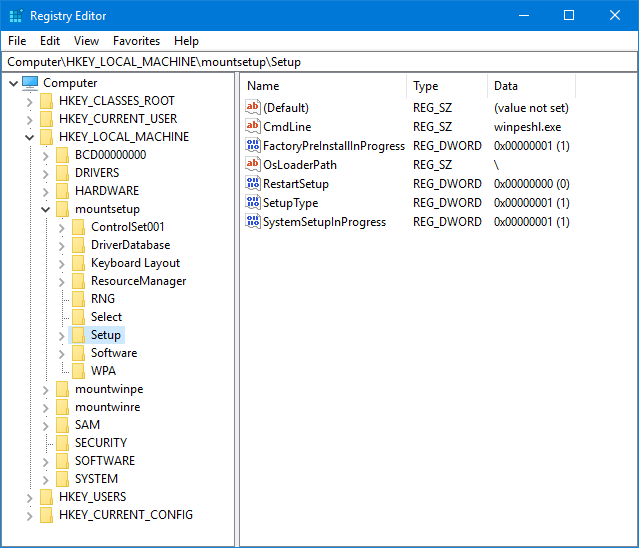

# WinPE Boot Process

For a good read on WinPE, check out the Microsoft Docs



## Winlogon

Winlogon.exe is executed on startup.  This will read the WinPE Registry at HKLM\System\Setup for the CmdLine value.  By default this is winpeshl.exe.  When winpeshl.exe executes, it reads values from winpeshl.ini



## Winpeshl.ini



_&lt;Does not exist&gt;_



_&lt;Does not exist&gt;_



\[LaunchApp\]

AppPath=X:\sources\recovery\recenv.exe



\[LaunchApps\]

%SYSTEMROOT%\System32\bddrun.exe,/bootstrap



\[LaunchApps\]

%SYSTEMDRIVE%\sms\bin\x64\TsBootShell.exe



## ConfigMgr: TSBootShell.ini

```text
[Shell]
OrgName=OSDeploy
EnableDebugShell=true
Run=X:\sms\bin\x64\TsmBootstrap.exe /env:WinPE /configpath:%CONFIGPATH%
```

## Startnet.cmd



wpeinit



wpeinit



wpeinit



wpeinit



wpeinit




